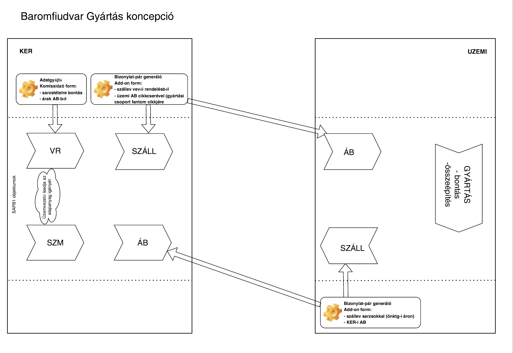

**BAROMFIUDVAR GYÁRTÓÜZEM -- SAPB1 Folyamatok**

# Bevezetés

Jelenleg egy egyszerű folyamattal adminisztráljuk az egyszerű gyártás
jellegű folyamatokat (kockázás, fagyasztás stb.):

-   Árubeérkezéssel bevételezik az alapanyagot.

-   Majd szállítói visszáruval adják át a csomagolóüzembe, aki egy
    partner. ('Csomagolóüzem' technikai szállító). Ezzel az alapanyag
    lekerül a készletről.

-   Árubeérkezéssel bevételezik a készterméket, ahol a partner ugyanez a
    'Csomagolóüzem' technikai szállító.

-   Majd ezt a két technikai bizonylatot bezárással bezárják.

Tényleges, bonyolultabb gyártási folyamatokat kezelni kívánjuk. Cél a
késztermék, illetve a beépülő alapanyag szavatosságának a felhasznált
alapanyag árának, a beérkezett bizonylatának és a beszállítónak a
visszakereshetősége, a nyomkövetése. Ehhez elengedhetetlen a sarzsos
nyilvántartás bevezetése. Viszont jelenleg nem kezelünk sarzsokat, a
sarzsos készletvezetésre való átállás hatalmas feladat lenne a jelenlegi
adatbázisban.

A gyártási folyamat során előfordulhat bontás -szétszerelés jellegű,
illetve klasszikus gyártás -összeszerelés jellegű folyamat is. Mindkét
fajta gyártás kezelésére fel kell készülni.

Induláskor a gyártási tevékenység egy üzemben fog megvalósulni. De fel
kell készülni arra is, ha a későbbiekben fizikailag is jól
elkülöníthetően több üzemben fognak gyártani, így a rendszerben is több
üzem folyamatát kezelni kell.

# Folyamat lépések

Létrehozunk egy külön technikai 'üzemi' adatbázist, ahol a gyártási
folyamatokat adminisztráljuk. A fő adatbázisban a jelenlegi módszertől
eltérő bizonylatokkal fog történi a készlet mozgások rögzítése, mivel
vevői oldalon kezeljük az alapanyag kiadást és nem szállítói
visszáruval. A gyártási folyamatok kezelése az üzemi adatbázisban fog
történni. A fő adatbázis és az üzemi adatbázis a bizonylatok
létrehozásakor addon biztosítja az adatok azonnali átadását. **[Lásd.: Gyártóüzemi bizonylatpár generáló addon specifikáció](Gyártóüzemi%20bizonylatpár%20generáló%20addon%20specifikáció.md)**

Ebben az üzemi adatbázisban nem tartunk karban se partnertörzset, se
cikktörzset. A cikkek interfészen keresztül kerülnek át a fő
adatbázisból. **[Lásd: Gyártóüzemi cikkinterfész specifikáció](Gyártóüzemi%20cikkinterfész%20specifikáció.md)**

-   Fő adatbázis: Nincs sarzskezelés, és itt nincs gyártás

-   Üzemi adatbázis: sarzskezelés, gyártási folyamatok adminisztrálása.
    Az üzemi adatbázisban a folyamatos készletvezetés beállításra kerül
    és a cikkek sarzsos kezelésűek és sarzsos értékelésűek lesznek.



A gyártási folyamatokat az alábbi lépésben tervezzük kezelni:

## 2.1. Árubeérkezés

A fő adatbázisban bevételezik árubeérkezéssel az alapanyagot a KER
raktárba. (Ahogy jelenleg)

## 2.2. Szállítói megrendelés

Manuálisan rögzítenek egy szállítói megrendelést a fő, kereskedelmi
adatbázisban az üzem szállítókódra a gyártandó késztermékekről. Mindig
rögzítsünk szállítói megrendelést.

Az üzemvezető ebből fogja tudni, hogy milyen terméket kell gyártania.

## 2.3. Vevői rendelés

A szállítói megrendelés alapján az üzemvezető leadja az alapanyag
igényét. Tehát manuálisan rögzít a kereskedelmi adatbázisban egy vevői
rendelést a gyártáshoz szükséges alapanyagokról.

2022.12.16: Vevői rendelés a teljes igényelt (kiadott) mennyiséget
rögzítik, ahogy most.

## 2.4. Kommissiózás

A tabletes adatgyűjtővel a vevői rendelés kommissiózásra kerül. A raktár
kiszedi az alapanyagot a fő adatbázisban lejárattal. (1 sor -- 1
lejárat) Ahogy a többi rendelést is a rendelést a jelenlegi folyamat
szerint lezárják, majd a raktárban feltöltik -- napi zárt,
túrafeltöltés. Emiatt a többi kommissiózó formról ki kell hagyni az
üzemi vevőkódnak a rendeléseit. (jelenlegi addon)

## 2.5. Szállítólevél generálás

Egy formon megmutatjuk a kikommissiózott, nyitott vevői rendeléseket. És
ezen a formon a vevői rendelés tételeket meg kell bontani szavidőnként
és árubeérkezésenkként, mivel az alapanyagnak ez alapján lesz lejárati
ideje és ára.

A gyártóüzemi bizonylatpár generáló addon első lépésben szállítólevelet
generál a komissiózott rendelésből (egy az egyben ugyanúgy). A
kommissiózásnál kiválasztott lejárat és árubeérkezés alapján kikeresi az
árubeérkezésből a beszerzési árakat, ez lesz a szállítólevél ára. Így
lekerülnek a készletről az alapanyagok.

Folyamatilag a szállítólevél alapján a túraelszámoltatást ugyanúgy kell
csinálni, mint a belső felhasználásnál. Ennek kell egy külön
rendeléstípus értéket felvenni: Gyártás. A rendelés formon ezeknek a
gyártóüzemi vevőknél csak ez a rendeléstípus lehet. (formatált keresés,
TN) Az elszámoltatás pedig ugyanúgy kinullázza az árakat, és ebből
generál nullás számlát. (0,01-es rendelések bezárása).

2022.12.16: A csomagolóanyagot rögtön beérkezéskor átadják az ÜZEM-i
adatbázisba. Célszerű a bizonylatpár generáló formon lekezelni.

## 2.6. Árubeérkezés (alapanyag)

A gyártóüzemi bizonylatpár generáló addon a szállítólevél készítésekor
azonnal, második lépésben árubeérkezést is generál ÜZEMI oldalon a
komissiózott rendelésből a beszerzési árakkal.

Az árubeérkezés tényleges sarzsokkal, a szavatossági idővel és árral jön
létre. Ezáltal az üzemi adatbázisban készletre kerülnek az alapanyagok.
Az üzemi adatbázisban egy listán lehetne látni az aznap készletre vett
termékeket. Az árubeérkezés az üzemi adatbázisban az alap
szállítólevélnek megfelelően egy az egyben ugyanúgy jön létre-- nincs
összevonás marad a soronként egy sarzs.

Az addon az árubeérkezésen a gyártási cikkcsoportoknak megfelelőn fantom
cikkcserét elvégzi.

## 2.7. Gyártás

Ezt követően a gyártási folyamatok adminisztrálása zajlik a rendszerben.
Kezelni kell mind az összeszerelés, mind a bontás jellegű gyártást. A
kétféle gyártást két felületen kell rögzíteni:

### Bontási folyamatok -- fejlesztés

> **Lásd: Gyártóüzem -- bontás specifikáció.doc -- Később**

### SAP Gyártás

-   Gyártási utasítás: gyártási utasításon meg kell adni a gyártandó
    cikkeket és mennyiséget. A darabjegyzék alapján pedig a
    felhasználandó alapanyagok kerülnek a gyártási utasításra.

-   Gyártásba adásra: Ez tulajdonképpen anyagkiadás, ezzel lekerülnek
    itt is a készletről az alapanyagok sarzsosan.

-   'Beérkezés gyártás'-ból: Ez tulajdonképpen egyfajta
    anyagbevételezés, amivel a késztermékek készletre kerülnek. A
    bizonylaton meg kell adni a késztermék sarzsokat.

A gyártás adminisztrálása utólag a 'Csomagolási napló' alapján történik,
az azon szereplő végleges mennyiségekkel.

A gyártás során többszintű gyártás is elő fog fordulni. Tehát a gyártási
folyamat során először félkész terméket is előállíthatunk. Amennyiben
már rögtön tudjuk, hogy az üzemi adatbázisban készletre vett 'félkész'
termékből további készterméket kell gyártanunk, akkor nem adjuk vissza a
fő adatbázisba. Hanem az üzemi adatbázisba felhasználjuk egy másik
gyártási folyamatban. Számviteli szempontból így nem egyértelmű a kész
és félkésztermékek elkülönítése, de a sarzsos készletvezetés miatt az
önköltségi árba beépül az ára és a nyomonkövetés is megoldott. A
többszintű gyártási folyamatban egymás után bontásos és összeszereléses
jellegű gyártási lépések is lehetnek. Például. először kicsontozunk egy
combot, tehát bontunk. A csontot rögtön késztermékként bevételezzük.
Majd rögtön utána össze is szereljük a húst, mert pl. tálcát, fóliát
teszünk a hús alá, csomagoljuk. Többszintű bontási gyártás kezelése
lépésenként külön-külön történik.

A gyártási veszteség (léveszteség) a jelenlegi módszerektől eltérően
értéke bele fog épülni a késztermék sarzsos önköltségi árba.

2022.12.16: A ténylegesen fel nem használt -megmaradt alapanyag
kezelése: A gyártási utasítás a 'Csomagolási napló' alapján készül,
ezért arra már a visszaadott alapanyaggal csökkentett mennyiséget kell
felvezetni. A maradék, fel nem használt alapanyag kezelése 2-féleképp
történhet:

-   ott marad készleten az 'ÜZEMI' adatbázisban és egy következő GYUS-on
    használják fel.

-   visszakerül a 'KER' adatbázisba, tehát az üzemiben lenullázódik a
    készlete.

Döntés kérdése

## Késztermék szállítólevél

Az üzemi adatbázisban egy formon kiválaszthatjuk a legyártott
késztermékeket, amelyeket át szeretnénk adni a kereskedelmi
adatbázisnak.

A gyártóüzemi bizonylatpár generáló addonnal a legyártott késztermék
cikkekről szállítólevelet készít sarzsosan az ÜZEMI adatbázisban. A
megfelelő üzemi raktárból lekerül a készletről a késztermék. A
szállítólevélen az ár a cikk önköltségi ára lesz.

## Késztermék árubeérkezés

A gyártóüzemi bizonylatpár generáló addon a szállítólevél készítésekor
azonnal, második lépésben árubeérkezést is generál KERESKEDELMI oldalon
a szállítólevélből, a szállítólevélen szereplő tételekkel és önköltségi
árral. (Egy az egyben egyezzen meg - az üzemi oldalon lévő
sarzsinformációk tétel szintű felhasználói mezőkbe kerülnek: sarzs,
lejárat, szállítólevél szám) Az üzemi adatbázisban lévő raktár-szállító
összerendelés alapján a megfelelő szállító partner lesz az
árubeérkezésen.

Az eredeti szállítói megrendelésre hivatkozás manuálisan történik. A
felhasználó a nyitott szállítói megrendeléseket lekérdezve lezárja a
bizonylatot, tételt lezár vagy tétel mennyiséget módosít.

## Javítások

A javításokat egy 'visszafelé' irányú addonal kezeljük.

**[Lásd: Gyártóüzemi javítások specifikáció](Gyártóüzemi%20javítások%20specifikáció.md)**

## Bizonylatok lezárása

A generált és nyitott bizonylatokat le kell zárni mindkét adatbázisban
-- később kerül pontosításra, hogy mikor és hogyan záródjanak a
bizonylatok. (szállítólevelek, árubeérkezések)

## Üzemek közötti áttárolás

Nem engedjük az üzemek közötti áttárolást. Amennyiben a két gyártóüzem
között kell átmozgatni alapanyagot, akkor először vissza kell adni a fő
adatbázisban a KER raktárba a termékeket.

# Törzsadatok

## 3.1. Partnerek

A kereskedelmi adatbázisban mind vevői, mind szállítói oldalon fel lesz
véve az üzemnek megfelelő partner:

-   S030000 (FELDOLGOZÓ ÜZEM)

-   V024598 FELDOLGOZÓ ÜZEM

Legyen 2 paraméter, amelyet a KERESKEDELMI adatbázisban TN tiltásoknál,
ellenőrzéseknél használunk:

-   gyártó szállítók

-   gyártó vevők

Ezeket a partnereket csak a gyártásnál használt formokon használhatjuk.

Az üzemi adatbázisban 2 Üzleti partner lesz: Az üzemi adatbázisban a
felhasználó nem vehet fel új partnert és nem is módosíthatja ezeket.

-   Vevő: V0001 - Baromfiudvar

-   Szállító: S0001 - Baromfiudvar

## 3.2 Raktárak

Az üzemi adatbázisban jelenleg 1 raktár lesz. Az üzemi adatbázisban a
raktárakhoz egy felhasználói mezőben hozzá kell rendelni a fő
adatbázisbeli szállítókódot, és a vevőkódot is --( U_GYARTAS_VEVO,
U_GYARTAS_SZALL).

A raktárakhoz hozzá kell rendelni a szállítólevél, illetve árubeérkezés
számozásokat:

-   Késztermék szállítólevél (U_GYSL_SZAMKOR)

-   Alapanyag visszáru szállítólevél (U_GYSV_SZAMKOR)

-   Alapanyag árubeérkezés (U_GYAB_SZAMKOR)

-   Késztermék visszavét árubeérkezés (U_GYAV_SZAMKOR)

Induló beállítások a 01 FELDOLGOZÓ ÜZEM raktárhoz:

-   U_GYARTAS_SZALL: S030000

-   U_GYARTAS_VEVO :V024598

```{=html}
<!-- -->
```
-   U_GYSL_SZAMKOR: \<ÉÉ\>GYSL01

-   U_GYSV_SZAMKOR: \<ÉÉ\>GYSV01

-   U_GYAB_SZAMKOR: \<ÉÉ\>GYAB01

-   U_GYAV_SZAMKOR: \<ÉÉ\>GYAV01

Egyelőre csak inaktívvá lett téve a 02 CSOMAGOLÓ ÜZEM 1 raktár -- ahogy
a kapcsolódó vevő/szállítókód is. (S030001, V024597)

## 3.3 Cikkek

A cikkek karbantartása, a cikk gyártási csoportosítása és az
interfészelendő cikkek megjelölése a KERESKEDLEMI fő adatbázisban
történik. Az üzemi adatbázisban tiltani kell a cikk karbantartást
(jogosultságkezelés, TN) **[Lásd: Gyártóüzemi interfész specifikáció](Gyártóüzemi%20cikkinterfész%20specifikáció.md)**

Sarzsszám felépítés:

-   [Alapanyag sarzs]{.underline}: docnum/linenum+1: Az átadó
    szállítólevél bizonylatszáma/sorszáma. (Sarzs attribútum: eredeti
    alapanyag cikkszám-fantomcikk miatt, lejárat (kötelező),
    árubeérkezés szám)

-   [Késztermék sarzs]{.underline}: Gyus szám/a beérkezés gyártásból
    getdate -- óra,perccel

Automatizmus kell az üzemi adatbázisban a 'Bevét gyártásból' bizonylaton
a sarzs létrehozó formon) (Kötelező sarzs attribútum: lejárat) -Megj: a
sarzsot a bevét gyártásból bizonylatszám alapján lenne jó létrehozni, de
sajnos a sarzsszám megadása előbb történik, mint a bevét gyártásból
bizonylat hozzáadása, így nem egyértelmű még abban a pillanatban, hogy a
bevét bizonylat milyen számot fog kapni. Ezért a késztermék sarzs a GYUS
szám-mal kezdődik, majd a sarzs létrehozásának pontos ideje.

## 3.4 Gyártási csoportok

A gyártási folyamatban problémát jelent, hogy az alapanyag cikkek
beszállítónként vannak felvéve. A gyártás során egy késztermékbe az
adott típusú alapanyagok bármelyikét felhasználhatjuk. Ez probléma,
mivel a SAP Gyártási modul nem tud darabjegyzék változatokat kezelni.

A fentiek miatt szükséges a cikkeket gyártás szempontjából is
csoportosítani. A gyártási csoportot mind a bontás (fejlesztés), mind az
összeépítés jellegű (SAP) gyártási folyamatoknál használni fogjuk.

A Gyártási csoportok karbantartására egy külön formon lesz lehetőség a
fő adatbázisban**. [Lásd: Gyártási csoportok form specifikció.doc](Gyártási%20csoportok%20form%20specifikáció.md)**

## 3.5 Darabjegyzékek, normák -- fantom cikkek, CS kódok

Az üzemi adatbázisban kell majd karbantartani a bontásos normákat,
illetve a SAP darabjegyzékeket.

A SAP Gyártás modul nem tud receptúra változatokat kezelni. Ezt a
következőképp fogjuk kezelni:

-   Az alapanyag cikkeket soroljuk be egy saját formon gyártási
    csoportokba. Minden gyártási csoporthoz tartozik az ÜZEMI SAP-ban
    egy fantomcikk (alapanyag cikkcsoport)

-   A gyártóüzemi bizonylatpár generáló addon a fő adatbázisba az
    alapanyag szállítólevelet a tényleges alapanyagokkal fogja
    generálni. Viszont az üzemi adatbázisban az árubeérkezést már a
    gyártási csoportoknak megfelelő 'fantom' cikkel fog létrejönni. (Az
    árubeérkezésen lévő sarzsoknál feltüntetjük az eredeti cikkszámot
    is.)

-   Az üzemi adatbázisban a darabjegyzékben a 'fantom' cikk szerepel,
    mint alapanyag. Tehát a gyártás erre a cikkre fog szólni.

Az SAP darabjegyzéket nem csak készletezhető cikkeket tartalmaznak,
hanem egyéb nem készletezhető cikkeket pl. munka, energia stb. Ezek
jelenleg is meg vannak egy Excelben, ezek a CS-kódok. A CS-kódoknak
megfelelően fel kell venni az erőforrásokat a darabjegyzékekbe.

TN: A gyártási utasításon legyen minimum egy erőforrás (CS-kód).

## 3.6. Bizonylatszámozás

Mivel egy üzem lesz induláskor, így a számozást nem kell bontani
üzemenként.

Induláskor a bizonylatszám felépítés:

-   1-2 karakter: év

-   3.karakter: FELDOLGOZÓ ÜZEM, jelenleg fix 9

-   4-5 karakter: bizonylattípus, szállítólevél és árubeérkezésen belül
    bontva

-   6-9 karakter: futó sorszám

pl.: 229030001

Mivel a szállítóleveleknél, illetve árubeérkezéseknél elkülönítjük
számozásban a javító bizonylatokat (külön bizonylattípussal az 4-5.
karakteren), ezért a bizonylatpár generáló addon, illetve a javító
bizonylatokat generáló addon is a megfelelő számkört kell használja.
Emiatt a raktárakhoz felvettünk 4 felhasználói mezőt, amelyben az egyes
bizonylattípusok számkörét lehet megadni.

# Fejlesztések

Összefoglalva a következő addonos fejlesztésekre van szükség:

**[Kereskedelmi adatbázis:]{.underline}**

-   **Gyártási csoportok form**

Lásd.: Gyártási csoportok form specifikáció.docx

-   **Átadás gyártásba form és Bizonylatpár generáló form** (fő
    szállítólevél -\>üzemi árubeérkezés fantomcikkel, sarzsosan)

Lásd.: Gyártóüzemi bizonylatpár generáló addon specifikáció.docx

-   **Javítás form**

Lásd.: Gyártóüzemi javítások specifikáció.docx

-   **Cikkinterfész** (kereskedelmi adatbázis -\>üzemi adatbázis)

Lásd.: Gyártóüzemi cikkinterfész specifikáció.docx

-   **Jelenlegi addon módosítása:** a gyártóüzemi vevőkódokat ki kell
    zárni a következő, jelenlegi addon formokról:

```{=html}
<!-- -->
```
-   Kimérés éjszaka: Friss

-   Kimérés éjszaka: Tej

-   Kimérés éjszaka: Száraz

-   Kimérés éjszaka: Töltelék

-   Kimérés éjszaka cikkre

-   Túrakitárolás

-   Túra kitárolás tárhelyes

-   Rendelés feldolgozás

-   

**[Üzemi adatbázis:]{.underline}**

-   **Gyártás -- bontás form**

**Lásd.: Gyártóüzem -- bontás specifikáció.docx**

-   **Késztermék átadás form és Bizonylatpár generáló form** (üzemi
    szállítólevél sarzsosan -- fő árubeérkezés)

Lásd.: Gyártóüzemi bizonylatpár generáló addon specifikáció.docx

-   **Javítás form**

Lásd.: Gyártóüzemi javítások specifikáció.docx

# Lekérdezések

-   Lekérdezés az utólagos árubeérkezés ármódosulásának a hatásáról.

> Egy dátum-tól -ig intervallumú lekérdezés, ahol kimutatjuk azokat a
> vevői szállítóleveleket és késztermék árubeérkezéseket, ahol az
> eredeti alapanyag árubeérkezés ára eltér szállítólevél árától.\
> A teljes folyamatlánc lekérdezése a két adatbázisból, kvázi gyártási
> kapcsolattérkép.

-   Az üzemi adatbázisban az aznap készletre vett termékekről.

-   A fő adatbázisban az aznap készletre vett késztermékekről.
