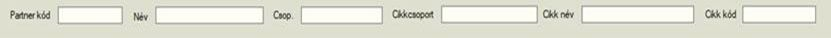
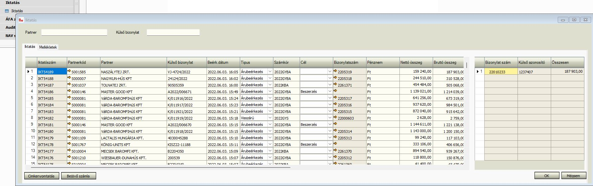
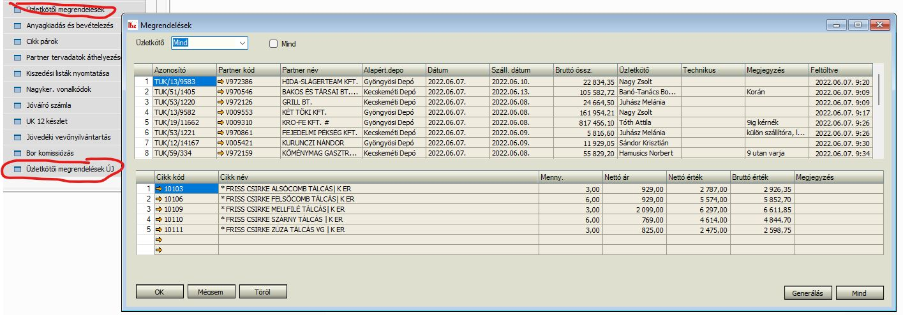
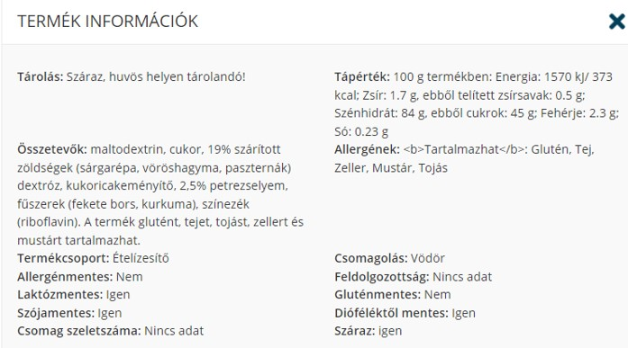
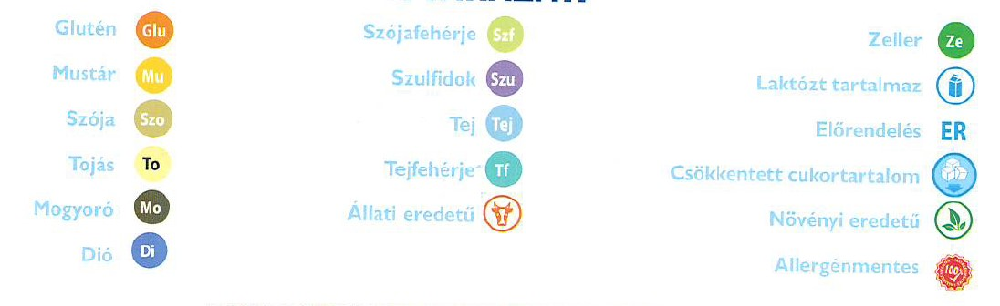
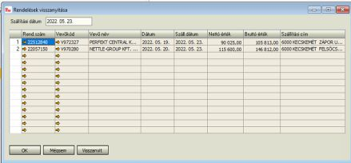

# Kedvenc Kereskedőház fejlesztés - SPCKhz - SPCEgyediAr

## Kinnlevőség kezelő modul

### Általános levélküldő szolgáltatás

A kinnlevőségekkel kapcsolatos fejlesztés az automatikus levélküldő szolgáltatást használja a partner számára történő emailek elküldésére. Ez a szolgáltatás a fejlesztői szerveren (192.168.20.162) a c:\spc\autemail mappában
található. Az itt lévő autemail.exe állományt az ütemezett feladatkezelő indítja el minden 15 percben. A program minden induláskor végignézi, milyen küldési feladatok vannak előírva, és lefuttatja ezeket.

A kinnlevőség modul küldési feladatait a telepítés során beállítottuk. Léteznek olyan formok (https://github.com/SpecSD/spc-admin.docs/blob/main/user/spc-admin-dok.md), ahol az általános levélküldő feladatait egy adminisztrátor testre tudja szabni (pl. milyen időközönként küldje), de ezek a formok
egyelőre nem lettek telepítve. A kinnlevőség modulhoz mi előre mindent beállítottunk.

### Heti fizetési emlékeztető

Egy küldési feladatot definiáltunk, aminek a kódja: "HETIFIZ", neve: "Heti fizetési emlékeztető". Ez úgy lett beállítva, hogy minden hétfőn 14 órakor fusson le.

Ez a feladat végignézi az összes vevő adott héten esedékes kinnlevőségeit. Amelyik vevőnek van ezen a héten lejáró, még nem rendezett számlája, de azok a vevők is, akinek csak korábbi kinnlevősége van, azoknak összeállít egy
listát a kinnlevőségeiről. Ebből a listából készít egy pdf dokumentumot, amit email csatolmányaként elküld az adott üzleti partnernek. Az email tárgyát és tartalmát az előre megadott sablon szerint állítja elő a program. ("Folyószámla-kivonat egyeztetése")

A következő feltételek érvényesülnek még:
- Arra az email címre történik a küldés, ami az üzleti partner "PÉNZÜGY..." azonosítóval elnevezett tárgyalópartnerénél meg van adva. Ha több ilyen is van, akkor mindegyik ilyen email címre elküldi. Ha egyáltalán nincs ilyen, akkor nem küld levelet.
- Azoknak a partnereknek nem küld levelet, akinél a 47.tulajdonság, a "Kinnlévőségkezelés - email küldés kivétel" be van pipálva.
- Azoknak a partnereknek nem küld levelet, akinél a 62.tulajdonság, a "Ügyvédi eljárás" be van pipálva.
- Azoknak a partnereknek nem küld levelet, akinél a 63.tulajdonság, a "Részletfizetési megállapodás" be van pipálva.

A folyószámlakivonat sablon definíciója crystal reports eszközzel lett elkészítve, "SPC heti fizetési emlékeztető" néven található meg a rendszerben. Ez alapján generálja ki a program a pdf fájlt.

Minden egyes kiküldött dokumentumot a program iktat. Egy új iktatószámot oszt neki, amit az email tárgyában, és a pdf állományban is feltüntet.

Az iktatott küldéseket az ["Email iktatások"](#kinnlevoseg-email-iktatások) menüpontban lehet megtekinteni.

### I. Fizetési felszólítás

Egy küldési feladatot definiáltunk, aminek a kódja: "FELSZ3", neve: "I. Fizetési felszólítás". Ez úgy lett beállítva, hogy minden nap 14 órakor fusson le.

Ez a feladat végignézi az összes vevőt, akinek három napja lejárt kinnlevősége van. Gyakorlatban akkor történik küldés, ha az adott napon van pontosan 3 napja lejárt tartozás. (Ha valamilyen oknál fogva az adott napon nem történt
meg a kiküldés, akkor később kiküldi. Valójában a program minden tartozást figyelembe vesz, de ha már korábban az adott lejáratra küldött felszólítást, akkor másnap már arra újat nem küld.)

Ennek a vevőnek egy teljes kinnlevőség listát készít a program. Ebből a listából készít egy pdf dokumentumot, amit email csatolmányaként elküld az adott üzleti partnernek. Az email tárgyát és tartalmát az előre megadott sablon szerint állítja elő a program.

A következő feltételek érvényesülnek még:
- Arra az email címre történik a küldés, ami az üzleti partner "PÉNZÜGY..." azonosítóval elnevezett tárgyalópartnerénél meg van adva. Ha több ilyen is van, akkor mindegyik ilyen email címre elküldi. Ha egyáltalán nincs ilyen, akkor nem küld levelet.
- Azoknak a partnereknek nem küld levelet, akinél a 47.tulajdonság, a "Kinnlévőségkezelés - email küldés kivétel" be van pipálva.
- Csak azoknak a partnereknek küld levelet, akinél a 48.tulajdonság, a "ASZF" be van pipálva!
- Azoknak a partnereknek nem küld levelet, akinél a 62.tulajdonság, a "Ügyvédi eljárás" be van pipálva.
- Azoknak a partnereknek nem küld levelet, akinél a 63.tulajdonság, a "Részletfizetési megállapodás" be van pipálva.
- Csak akkor küld fizetési felszólítást, ha az adott napon 3. napja lejáró számlán (vagy számlákon) a tartozás pozitív.

A fizetési felszólítás sablon definíciója crystal reports eszközzel lett elkészítve, "I. Fizetési felszólítás" néven található meg a rendszerben. Ez alapján generálja ki a program a pdf fájlt.

Minden egyes kiküldött dokumentumot a program iktat. Egy új iktatószámot oszt neki, amit az email tárgyában, és a pdf állományban is feltüntet.

Az iktatott küldéseket az ["Email iktatások"](#kinnlevoseg-email-iktatások) menüpontban lehet megtekinteni.

### II. Fizetési felszólítás

Egy küldési feladatot definiáltunk, aminek a kódja: "FELSZ12", neve: "II. Fizetési felszólítás". Ez úgy lett beállítva, hogy minden nap 14 órakor fusson le.

Ez a feladat végignézi az összes vevőt, akinek 12 napja lejárt kinnlevősége van. Gyakorlatban akkor történik küldés, ha az adott napon van pontosan 12 napja lejárt tartozás. (Ha valamilyen oknál fogva az adott napon nem történt
meg a kiküldés, akkor később kiküldi. Valójában a program minden tartozást figyelembe vesz, de ha már korábban az adott lejáratra küldött felszólítást, akkor másnap már arra újat nem küld.)

Ennek a vevőnek egy teljes kinnlevőség listát készít a program. Ebből a listából készít egy pdf dokumentumot, amit email csatolmányaként elküld az adott üzleti partnernek. Az email tárgyát és tartalmát az előre megadott sablon szerint állítja elő a program.

A következő feltételek érvényesülnek még:
- Arra az email címre történik a küldés, ami az üzleti partner "PÉNZÜGY..." azonosítóval elnevezett tárgyalópartnerénél meg van adva. Ha több ilyen is van, akkor mindegyik ilyen email címre elküldi. Ha egyáltalán nincs ilyen, akkor nem küld levelet.
- Azoknak a partnereknek nem küld levelet, akinél a 47.tulajdonság, a "Kinnlévőségkezelés - email küldés kivétel" be van pipálva.
- Csak azoknak a partnereknek küld levelet, akinél a 48.tulajdonság, a "ASZF" be van pipálva!
- Azoknak a partnereknek nem küld levelet, akinél a 62.tulajdonság, a "Ügyvédi eljárás" be van pipálva.
- Azoknak a partnereknek nem küld levelet, akinél a 63.tulajdonság, a "Részletfizetési megállapodás" be van pipálva.
- Csak akkor küld fizetési felszólítást, ha az adott napon 12. napja lejáró számlán (vagy számlákon) a tartozás nagyobb, mint 500Ft.

A fizetési felszólítás sablon definíciója crystal reports eszközzel lett elkészítve, "II. Fizetési felszólítás" néven található meg a rendszerben. Ez alapján generálja ki a program a pdf fájlt.

A II. fizetési felszólításhoz kapcsolódóan automatikusan egy számla is készül, amiben 2500Ft adminisztrációs díj kerül felszámolásra. Ezek a számlák is csatolmányként csatolódnak a levélhez.

Minden egyes kiküldött dokumentumot a program iktat. Egy új iktatószámot oszt neki, amit az email tárgyában, és a pdf állományban is feltüntet.

Az iktatott küldéseket az ["Email iktatások"](#kinnlevoseg-email-iktatások) menüpontban lehet megtekinteni.

### Ügyvédi felszólítás

A 18 napnál régebbi tartozásokról nem teljesen automatikusan küldjük a felszólítást. Erre egy új form készült.

#### Felső blokk

A korábban iktatott felszólításokat mutatjuk meg itt, illetve nyitott státuszban megjelenik egy-egy felszólítás "terv" azon partnerek számára is, akiknek van legalább 18 napja lejárt tartozása, és még erről nem küldtünk
neki ügyvédi felszólítást. A nyitott felszólítás terveket minden éjszaka egy automatizmus generálja le. A korábban nyitva hagyott felszólításokat is aktualizálja.

A blokkban egyik mezőt sem tudjuk módosítani:

| Mező       | Leírás                                         |
|:---------- |:---------------------------------------------- |
| Iktatószám | Az iktatási azonosító                          |
| Partnerkód | A vevő kódja, lefúró nyíl a partnertörzsre     |
| Partnernév | A partnertörzsben megadott partnernév          |
| Időpont    | Ekkor történt meg ez az iktatás                |
| link       | Az ügyvédi felszólítás pdf-ére hivatkozó link. |
| Összesen   | Összese tartozás                               |
| Státusz    | Az ügyvédi felszólítás státusza |

A blokkbeli táblázat fölött egy szűrési eszközsor és egy funkció gombsor található. A szűrési sorral a megjelenített adatok körét tudjuk szűkíteni, a gombsorral különböző funkciók hajthatók végre.

| Mező       | Leírás                                         |
|:---------- |:---------------------------------------------- |
| Dátumtól | Szűrés: Az ezen dátum előtti ügyvédi felszólításokat nem akarjuk látni. (Alapértelmezés az utolsó két hét, de lehet rajta változtatni.) |
| Dátumig  | Szűrés: Az ezen dátum utáni ügyvédi felszólításokat nem akarjuk látni. (Ha üres, akkor nincs felső időbeli határ.) |
| Státusz | Szűrés: Több értéket is ki lehet választani, amiket kiválasztottunk azokat a státuszú ügyvédi felszólításokat mutatjuk a táblázatban. |
| Érvényesítés | A kiválasztott ügyvédi felszólítást [érvényesíti](#kinnlevoseg-ervenyesites). |
| Elengedés | A kiválasztott ügyvédi felszólításhoz kapcsolt tartozásokat [elengedjük](#kinnlevoseg-elengedes) ezzel a funkcióval |
| Visszavonás | A kiválasztott érvényesített ügyvédi felszólítást [visszavonjuk](#kinnlevoseg-visszavonas) |

A táblába egy éjszakára ütemezett naponta rendszeresen futó feladat automatikusan szúrja be, és tartja karban a sorokat. Van egy STATUSZ mező, aminek az értékei ezek lehetnek:
- O: Nyitott
- L: Érvényes
- C: Visszavont
- X: Elengedett

Az éjszakai munkafolyamat által beszúrt sorok "O" - nyitott státuszúak lesznek. A munkafolyamat működése külön fejezetben van részletezve.

##### Alsó blokk

Az adott vevőhöz kapcsolódóan megjelennek a 18 napnál régebbi tartozások a korosított lista lekérdezés alapján.

A blokkban új sort nem tudunk felvenni, és egyik mezőt sem tudjuk módosítani. A megjelenített mezők:

| Mező              | Leírás                                 |
|:----------------- |:-------------------------------------- |
| Bizonylat típus   | A bizonylat típusa                     |
| Bizonylatszám     |                                        |
| Teljes össszeg    |                                        |
| Fizetendő         |                                        |
| Fizetési határidő |                                        |
| Késedelem         | A késedelem a mai napig napok számában |

##### Éjszakai munkafolyamat működése

Naponta egyszeri futásra van beütemezve, olyan időpontra, amikor kevés egyéb folyamatot zavar.

A lépések:
- Az ügyvédi felszólítások táblából törli azokat a sorokat, amik "nyitott" státuszú fejhez tartoznak.
- Korosított listát készít az összes paraméterre. A korosított lista bemenő dátumai a mai napra vonatkoznak. (Vagy tegnapi, ha éjfél után állítjuk be a munkafolyamatot.)
- Ez visszaadja az összes nyitott kinnlevőségét a partnereknek. (Azokat is, ami olyan bizonylatra vonatkozik, amire már küldtünk felszólítást.)
- Azokat kivesszük belőle, amelyik bizonylat már szerepel valamelyik ügyvédi felszólítás tételei között "érvényes", vagy "elengedett" fej státusszal.
- A maradékokat partnerenként csoportosítja, és minden partnerre létrehoz egy fejet "nyitott" státusszal.
- Mindegyik nyitott felszólítás fej alá beszúrja azokat a tételeket, amit a korosított lista erre a partnerre kiadott. (És nem töröltük ki amiatt, hogy már korábban ebből történt ügyvédi felszólítás.)
- Fej szinten összegzi is a tartozásokat.

Ennek a munkafolyamatnak az eredményeképpen minden nap reggel az aktuális, teljesen feltöltött nyitott ügyvédi felszólítások fogadják a felhasználót. Ezekkel a nyitott felszólításokkal kapcsolatban
kell eldönteni, hogy mit teszünk: érvényesítjük, elengedjük, esetleg kihagyunk belőle bizonyos számlákat.

##### Érvényesítés <a name="kinnlevoseg-ervenyesites"></a>

A felső blokk adott nyitott fején állva ha megnyomjuk a generál gombot, akkor véglegesítődik az ügyvédi felszólítás. Csak nyitott státusz esetén értelmezhető ez a funkció.

A következők történnek:
- Újra összegzést végez. A fejhez kapcsolódó nem "törölt" tételsorokat összegzi, és ezt beírja a fejbe.
- A tételben lévő logikailag törölt sorokat fizikailag is törli.
- Elkészül az ügyvédi felszólítás nyomtatási képe, pdf formában a szerverre mentésre kerül. Ez az útvonal beíródik a link mezőbe.
- TODO: Adminisztrációs díj kerül felszámolásra... generál egy számlát?
- A státusz "érvényes"-re vált.
- Megkapja az iktatószámot. Ez egy külön szekvenciából jöjjön - csak "L" és "C" státuszú felszólításokon lesz iktatószám.

Generálás után frissítjük a képernyőn látható adatokat.

##### Elengedés <a name="kinnlevoseg-elengedes"></a>

Ez a funkció is csak nyitott státuszban értelmezhető, és a kiválaszott fejre vonatkozik.

Mindössze annyi történik, hogy a státusz átvált "elengedett"-re. Eredményeképpen az ez alatt szereplő bizonylatokat a továbbiakban nem fogja figyelembe venni a program az újabb felszólítások generálása során.

##### Visszavonás <a name="kinnlevoseg-visszavonas"></a>

Külön nyomógomb, ez a funkció "L" - érvényes státuszban értelmezhető, és a kiválaszott fejre vonatkozik.

Mindössze annyi történik, hogy a státusz átvált "visszavont"-ra ("C").

A "C" státuszú, visszavont felszólításoknál a linket ne engedjük megnyitni, rejtsük el, nehogy kinyomtassa.

##### Tétel törlés

Ez a funkció a tételsorokra vonatkozik, és csak nyitott fej esetén használható. Bármelyik tétel törölhető.  
Logikai törlést jelent, vagyis ezek a bizonylatok még ott szerepelnek az ügyvédi felszólítás tételei között, csak a képernyőn külön színnel jelöljük.
A logikailag törölt tételek már nem számítanak bele a nagy összesenbe, ezért törlés után újraszámoljuk a fej összesen mezőt.

A logikailag törölt tételek visszaállíthatóak. Erre a "Tételek visszaállít" gomb használható, amit az adott ügyvédi felszólítás alatti összes törölt tételt visszaállítja nem töröltre.

Ha egy "nyitott" ügyvédi felszólítás tételeiből töröltünk, de aznap nem érvényesítettük, vagy engedtük el azt, akkor az éjszakai folyamat másnapra visszaállítja ezt a törlést, és aktualizálja az adott partnerhez tartozó tételsorokat.

### Email iktatások <a name="kinnlevoseg-email-iktatások"></a>

Ezen a formon meg lehet nézni az iktatott emailküldéseket. Fent az időszakra lehet szűrni, alatta megjelenik az adott időszakra a teljes lista.

| Mező       | Leírás                                         |
|:---------- |:---------------------------------------------- |
| Iktatószám | Az iktatási azonosító                          |
| Státusz | El lett-e küldve, vagy valamelyik lépésnél hiba történt |
| ÜP.kód | |
| ÜP.név | |
| Címzettek | E-mail cím |
| Létrehozva | A létrehozás dátuma |
| Kiküldve | Elküldés dátuma |
| Email tárgya | |
| Hiba | Ha nem sikerült a küldés |
| Összeg | A teljes összeg |
| Akt.összeg | Az aktuális összeg |
| Csatolmányok | Letölthető link |

Összeg mező: A teljes tartozását mutatja a partnernek a fizetési felszólítások esetén.  
Aktuális összeg mező: I. fizetési felszólítás esetén a 3 napja lejárt számla (számlák) tartozását mutatja. A II. fizetési felszólítás esetén a 12 napja lejárt számla (számlák) tartozását mutatja.

## Változó minimál árak kezelése

Szeretnénk egy új árazós formot a minimál áras árlista áránál kisebb egyedi árak gyors módosítására.

A formon szeretnénk azokat az egyedi árakat (partnerenként, cikkenként)megjeleníteni és módosítani ami a minimál áras árlista(mindig a form elindítás napján érvényes minimál árat kell vizsgálni) áránál kisebb.

A formon az alábbi szűrési lehetőségek legyenek:


A formon az alábbi oszlopok jelenjenek meg:
partnerkód, partnernév, cikkszám, cikknév, me, egyedi ár dátuma –tól -ig(legyen írható), egyedi ár (legyen írható),3x checkbox, Árlista checkbox, beszerzési ár, engedmény%, Pénznem.

A formon soronként is és kijelölés szerint is lehessen aktualizálni az új egyedi árat és a dátum intervallumot. Aktualizálás után a régi egyedi ár dátum intervalluma legyen lezárva és az új intervallummal kerüljön berögzítésre az új egyedi ár.

Az így történt módosítások kerüljenek be az archív árazási naplóba.

----------------

### 2022.06.27-én ez volt a kérés:

Egy új form-ra lenne szükségünk. A formnak az alábbi 2 részből kellene állnia:

| Cikkszám | Cikknév | ME | Előző napi minimál ár | Mai minimál ár | Különbség |
| ------ | ------ | ------ | ------ | ------ | ------ |
|  |  |  |  |  |  |
|  |  |  |  |  |  |

| Partnerkód | Partnernév | Partnercsoport | Üzletkötő | Dátum-tól | Dátum-ig | Eng%| Jelenlegi ár | Új egyedi ár | Pénznem | 3x | Árlista |
| ------ | ------ | ------ | ------ | ------ | ------ | ------ | ------ | ------ | ------ | ------ | ------ |
|  |  |  |  |  |  |  |  |  |  |  |  |
|  |  |  |  |  |  |  |  |  |  |  |  |
 
Az első résznek fel kell hoznia minden olyan cikket aminek, a minimál ára az előző naphoz képest változott. Az előző napi minimál árakat a KKH_ARLISTAK_NAPLO tábla tartalmazza.

Ezen a panelen egy cikkre ráállva a második panel felhozná azokat a partnereket amelyeknek a következő szállítási naptól bár melyik napra van egyedi ár rögzítve.
A kollégák úgy szeretnénk használni, hogy a második panelen leszűr egy dátum-ig értékre(Pl.:2022.09.02). Majd ezután az új egyediár mezőket kitölti. Annál ahol új árat adott meg a partnernél lévő jelenlegi intervallumot aktualizálás gombra lezárja rendszer a mai nappal. Az új egyedi árat felrögzíti egy új intervallumba (A mai naptól az eredeti Dátum-ig értékkel.).

A 3x és az árlista mező alapból legyen bejelölve.

A módosításokat a meglévő napló táblába vezetni kellene.

## Iktató modul

A jelenlegi formhoz hasonlót kellene felépíteni pár módosítással.

A form elindítása után ne töltse be rögtön a több évnyi iktatott anyagot.

Legyen egy beérkezés dátuma szerinti intervallum szűrő. Alapértemezettként ez legyen az elmút 30 nap (Pl: 2022.05.04-2022.06.03)


HG megjegyzés: Át kellene alakítani, hogy ne (csak?) a fejben legyen a típus (árubeérkezés, visszáru), hanem a tételben is. Így egyszerre több alapbizonylatot is hozzá lehet rendelni egy iktatáshoz. Természetesen előjelesen kellene megtenni.

Első körben ne erőltessük a csatolmányokat, azt most sem használják. De a későbbiekben kelleni fog.

Fontos kérdés még a nyomógombra DI API bizonylat generálás.

## Üzletkötői rendelések beforgatása

Jelenleg két különálló formot használunk az ük laptopos, ük tabletes, webshop-os rendelések beforgatására.
Az szeretnénk ha egy fomon keresztül meg tudnánk oldani.

A következő módosításokat kellene benne elkészíteni az eredeti formhoz képest.

A beforgatáskor jelenleg minden terméket a központi raktárra forgat be a rendszer. Az szeretnénk hogy ha a megjegyzés mezőbe szerepel `##12##` karakter sor akkor a partner alapértelmezett depója szerinti 12-es raktárra legyen beforgatva a tétel.

Szeretnénk ha minden egyes cikk tétel meg lenne jelölve, hogy melyik platformról érkezett.


### Megvalósítás

A jelenleg használt két form az ifsz addonban van, ezeket kell kiváltani úgy, hogy egy formot készítünk a kettőre.

A form tetején nem kell a szokásos aktualizálás gomb, mert a két blokk teljesen readonly lesz, de egyéb gombok lesznek (mivel az ifsz-es felületen is ezek vannak): "Töröl", "Generálás", "Összes generálása". Ezeknek a működése lentebb lesz részletezve. Kellenek még fentre az ifsz-hez hasonlóan szűrő mezők: "Üzletkötő" combobox, "Mind" checkbox, "Forrás" combobox. Szerintem legyen még egy "Frissít" nyomógomb is.

A gomb és szűrősor alatt van gridszerűen a master blokk. Ami a képernyőképen is látszik fentebb. Ennek az oszlopai legyenek: Azonosító, Partner kód, Partner név, Dátum, száll. dátum, bruttó össz, üzletkötő, megjegyzés, feltöltve, forrás. Ennek az alap adatbázis nézetére hozzunk létre egy SPC-s nézetet (SPC_F_UKR_ORDR_V). A mostani két ifsz-es nézetet kell összefésülni: IFSZ_IFE_ORDR_V és IFSZ_UK_MRS_V. Ez utóbbiban nincs "forras" oszlop, az első nézetben a "forras" 'UK', vagy 'WEB' értéket vehet fel. Az összeuniózott új SPC-s nézetünkben a forras oszlop értéke egy harmadik érték legyen azoknál, amik az IFSZ_UJ_MRS_V-ből jönnének. (Mondjuk 'UKM' - "Üzletkötői modul". Ha jól tudom, ezek olyan rendelések, amik az üzletkötői modulból jönnek. Ha később mégis más elnevezést akarnak, akkor a domainben megváltoztatjuk az elnevezését valami másra.)

Az alsó grid a tétel adatokat tartalmazza: Cikk kód, cikk név, Mennyiség, Nettó ár, nettó érték, bruttó érték, megjegyzés. Erre is hozzunk létre egy SPC-s nézetet: SPC_F_UKR_RDR1_V. Ez az IFSZ_IFE_RDR1_V és az IFSZ_UK_MRS_TETELEK_V nézetek uniója kell, hogy legyen.

#### Fenti gombsor működése

##### Töröl

1. Mindig a kiválasztott rendelésre (fej) vonatkozik. Rá kell kérdezni, hogy valóban törölni akarja az xy bizonylatszámú rendelést? (Amelyiken éppen áll a felső blokkban.) Ha abban a sorban a TRANSZFERALVA oszlop értéke nem 'N', akkor csak ki kell írni, hogy "A rendelés már fel lett dolgozva"
2. Ha igent nyomott, és a TRANSZFERALVA = 'N', akkor update-elni kell az alaptáblában a TRANSZFERALVA oszlopot 'T'-re. (A MANUALNUM oszlop alapján lehet megtenni, tehát `update ... set transzferalva = 'T' where manualnum = '...'`
3. Utána frissítjük a teljes blokkot. (El kell tűnnie a képernyőről a törölt rendelésnek.)

Alaptábla: (A nézetből kitalálható)
- Ha forras = 'UK': IFSZ_IFE_ORDR
- Ha forras = 'WEB': IFSZ_WS_IFE_ORDR
- Ha forras = 'UKM': IFSZ_UK_ORDR

##### Generálás

A kiválasztott rendelésre vonatkozik.

1. Csak akkor, ha a TRANSZFERALVA = 'N'. Egyébként: "A rendelés már fel lett dolgozva"
2. Rákérdezünk: "Ki akarja generálni a rendelést?"
3. Ha igent válaszol, akkor DI API-val létrehozunk egy SBO-s rendelést. Ezt külön írom le lentebb.
4. Ha sikeresen lefutott a generálás, akkor frissítjük a blokkot.

##### Összes generálása

1. Rákérdezünk: "Az összes rendelést fel akarja dolgozni?"
2. Ha igent nyom, akkor végigmegyünk a felső blokk összes során, és amelyikben a transzferalva = 'N', azokra lefuttatjuk a DI API-s rendelés generálást.

##### Frissít

Ennek ki kell adnia egy fej BlockRefresh-t mégpedig olyan DefaultWhere-rel, amit a szűrő feltételek meghatároznak.

#### Szűrő feltételek

##### Üzletkötő

Legördülőlista, amiben az OSLP táblában lévő sorok kellenek. SlpCode és SlpName. Plusz egy "Mind" érték, alapból ezen áll. Ha "Mind"-en áll, akkor nem szűkítünk üzletkötőre. Egyébként a kiválasztott SlpCode-ra szűrünk. (Az SPC_F_UKR_ORDR_V-ben lesz egy SLPCODE oszlop.) Vagyis a defaultwhere kiegészül az SLPCODE = ...-tal.

##### Mind

Ha ez a checkbox nincs bejelölve, akkor a TRANSZFERALVA in ('N', 'I')-re kell szűrni. Ha be van pipálva, akkor TRANSZFERALVA = 'N', ezt bele kell tenni a defaultwhere-be. (Lehet, hogy érdemes már az SPC_F_UKR_ORDR_V-be betenni egy TRANSZFERALVA in ('N', 'I') feltételt)

##### Forrás

Legördülő lista három plusz egy értékkel:
- Mind
- UK - Üzletkötő
- WEB - Web
- UKM - Üzletkötő modul

Ha a mind ki van választva, akkor nem szűrünk tovább, ha bármelyik a többi közül, akkor ezt adjuk a defaultwhere-hez: "forras = '...'"

#### DI API rendelés generálás

- Először újra bizonyosodjunk meg róla, hogy az alaptáblában a transzferalva oszlop értéke 'N'. Ha nem az, akkor hibát kell dobnunk. Egyébként folytatjuk.
- Azt is megnézzük, hogy nem lett-e már kigenerálva/elkészítve ezzel a manualnummal rendelés: `select count(*) from ordr where NumAtCard like '%<manualnum>%'` (az uk-s, webes rendelés bizonylatszámára kell rákeresni) Ha már van ilyen, akkor is hibát dobunk.
- Előkészítés
  - Meg kell keresni az adott partnerhez tartozó árlista azonosítót (ListNum) és annak pénznemét (U_penznem) ezzel a selecttel: `select ocrd.ListNum, opln.U_penznem from ocrd inner join opln on ocrd.ListNum = opln.ListNum where ocrd.cardcode = '...'`
  - Jegyezzük meg az üzletkötő nevét: `select isnull(U_fnev, N'') from oslp where oslp.slpcode='...'`
  - Meg kell keresni az UK_KPVEVO (ifsz) paraméter értékét: `select "U_Value" from "@IFSZ_PARAMETERS" where "Name" = 'UK_KPVEVO'`
  - Meg kell néznünk, hogy az adott partnernek van-e másik nyitott rendelése ugyanerre a napra. Ha van, annak a docentry-jét el kell tárolnunk. Ha nincs, akkor ez a select -1-et ad vissza, egyébként a docentry-t: `select isnull( min(docentry), -1 ) from ordr where cardcode = '...' and docduedate = ... and docstatus = 'O' and u_rendzar = 'N' and u_tipus <> N'Áruminta'`
  - Meg kell tudnunk, hogy a partner az egy bolt-e (Ha ez a select 0-nál nagyobbat ad vissza): `select count(*) from ocrd where GroupCode = 254 and cardcode = '...'`
  - Meg kell nézni, hogy a tételek között szerepel-e jövedéki termék.: `select count(*) from IFSZ_IFE_RDR1 a inner join oitm on a.itemcode = oitm.itemcode and itmsgrpcod in (235,236,237) and a.ordr_id = ...` Természetesen a forrástól függően ez a tábla lehet az IFSZ_WS_IFE_RDR1 vagy az IFSZ_UK_RDR1.
- Amennyiben a partnernek még nincs nyitott rendelése az adott napra, **vagy** a CARDCODE megegyezik az UK_KPVEVO paraméter értékével, **vagy** boltról van szó, **vagy** van a tételek között jövedéki cikk, akkor
  - új rendelést kell létrehozni
  - egyébként a megtalált nyitott rendelést kell módosítani
- Fej adatok új rendelés létrehozásánál:
  - CardCode - CARDCODE
  - DocDate - DOCDATE
  - DocDueDate - DOCDUEDATE
  - NumAtCard - MANUALNUM
  - U_rendforr - '1'
  - Comments - COMMENTS
  - DocCurrency - A partner árlistájának U_penznem-e. (Elvileg mindig Ft, ilyenkor nem is kell megadni, egyébként meg EUR lehet, ilyenkor adjunk 'EUR'-t értéknek.
  - SalesPersonCode - SlpCode
  - DocumentsOwner - Amennyiben az üzletkötő nevével azonos felhasználóhoz tartozik dolgozó, akkor annak a kódja. Ha nem, akkor nem töltjük: `select isnull( min(ohem.empid), -1) from ohem inner join ousr on ohem.userid=ousr.internal_k inner join oslp on ousr.u_name = oslp.slpname where oslp.slpcode=...`
  - U_depo - `select isnull(U_alapdepo,'01') from ocrd where cardcode = '...'`
  - U_SZLACIM - `select a.U_SZLACIM from ocrd inner join [@IFSZ_DEPO_CIMEK] a on a.Code =isnull(U_alapdepo,'01') where cardcode = '...'`
  - U_telesdolg - `SELECT top 1 T1.[LastName] + ' ' + T1.[FirstName] FROM [dbo].[OCRD] T0 INNER JOIN ohem T1 ON T0.DfTcnician = T1.EmpID WHERE T0.[CardCode]= '...' and T0.QryGroup26 = 'Y'` (Lehet, hogy ezeket az értékeket érdemes akár összevont select-ben is, még az előkészítési fázisban előszedni.)
- Tétel adatok (Az IFSZ_..._RDR1 táblából):
  - ItemCode - ITEMCODE
  - Quantity - QUANTITY
  - U_orimenny - QUANTITY
  - Price - `select [dbo].ifsz_egysegar_f('<cardcode>','<itemcode>', <quantity>, <docduedate>)`
  - Currency - `select [dbo].ifsz_penznem_f('<cardcode>','<itemcode>', <quantity>, <docduedate>)`
  - FreeText - Comments
  - WareHouseCode
    - Ha a partner depója '01', vagy '02', akkor `SELECT ISNULL( MIN(CASE WHEN T0.Onhand-T0.IsCommited>0 THEN 'GY_12' ELSE 'GY_KOZP' END), 'GY_KOZP') FROM OITW T0 WHERE T0.ItemCode ='...' and T0.WhsCode='GY_12'`
      - és nem szerepel a tétel megjegyzésében a `#12#`: "GY_KOZP"
      - és szerepel a tétel megjegyzésében a `#12#`: "GY_12"
    - Egyébként
      - és nem szerepel a tétel megjegyzésében a `#12#`: "KE_KOZP"
      - és szerepel a tétel megjegyzésében a `#12#`: "KE_12"
  - U_usercode - Az üzletkötőhöz megtalált felhasználó neve
- Fej adatok meglévő sbo-s rendelés esetén:
  - NumAtCard - Hozzá kell fűzni a meglévő NumAtCard végére egy ';'-t és utána a MANUALNUM-ot. Ha már 100-nál hosszabb lenne, akkor ne fűzzük hozzá, mert nem fér bele, hibára fut.
  - Comments - Ehhez is fűzzük hozzá egy szóközzel az új COMMENTS-et. Ez 254 hosszú lehet, ezt se lépjük át.
- Tételsor meglévő sbo-s rendelés esetén: `select isnull(min(LineNum), -1) from rdr1 where docentry = ... and itemcode = '<itemcode>' and isnull(FreeTxt,'') = '<tételcomment>'`
  - Ha ez a select nem talál adatot (=-1), akkor új rendelés tételt adunk hozzá, ugyanúgy mint új rendelés esetén
  - Ha megtalálja a sort, akkor azt a sort kell módosítani:
    - Quantity - hozzáadni a QUANTITY-t
    - U_orimenny - A jelenlegi, a rendelés tételen lévő Quantity értéke
- Ha sikeresen létrejön az SBO-s rendelés, akkor vissza kell jelezni az eredeti táblába (IFSZ_IFE_ORDR/IFSZ_WS_IFE_ORDR/IFSZ_UK_ORDR) a feldolgozás sikerét: `update alaptábla set TRANSZFERALVA = 'I' where ManualNum ='...'`

## Minimál ár kalkulátor

### Igény

Első körben szükségük lenne egy megjelenítő segéd formra ahol megjelennének az alábbi oszlopok:
cikkszám, cikknév, cikkfőcsoport, cikkalcsoport1, várható beszerzési ár, jelenlegi minimál ár, kalkulált új minimál ár, elmúlt 30-nap értékesített mennyiség.
Az oszlopokra lehessen szűrni.
A kalkulált minimál ár mező az alábbihoz hasonló funkcióval legyen töltve:
(a paraméterek pontosítása még zajlik nem a mi adatbázisunkra készült a minta).

```
CREATE FUNCTION [dbo].[T_kalkulalt_min_cikkre] (@cikkszam as nvarchar(20),@varhato as numeric(19,0))
RETURNS TABLE
AS
RETURN 
(
select isnull(cast(round(Beszár+Egységsúly*Minárplusz,0) as numeric(19,0)),0) [Kalkulalt_min],1 [Kalkulalt_ujs]
from (
select nn.ItemCode [Cikkszám],nn.Beszár
,case  when Cikkcsoport = N'EH Húskészítmények' and [Beszár/kg]<=750 then 75
             when Cikkcsoport = N'EH Húskészítmények' and [Beszár/kg] between 1000 and 1750 then 150 
             when Cikkcsoport = N'EH Tejtermékek' and [Beszár/kg] <= 300 then 35 
             when Cikkcsoport = N'EH Tejtermékek' and [Beszár/kg] >300 and [Beszár/kg]<= 600 then 80
             when Cikkcsoport = N'EH Tejtermékek' and [Beszár/kg] > 600 and [Beszár/kg]<=  1000 then 120
             when Cikkcsoport = N'EH Zöldség' and [Beszár/kg]<=1500 then 150
             when Cikkcsoport = N'FAGY Baromfi' and [Beszár/kg]<=1000 then 100
             when Cikkcsoport = N'FAGY Burgonya' and U_marka='183' and U_termekcsop = '0918' then 400
             when Cikkcsoport = N'FAGY Burgonya' and [Beszár/kg]<=750 then 75
             when Cikkcsoport = N'FAGY Burgonya' and [Beszár/kg] > 750 and [Beszár/kg]<= 1500 then 150
             when Cikkcsoport = N'FAGY Fűszerek, fűszerkeverékek' then [Beszár/kg]*0.25
             when Cikkcsoport = N'FAGY Fűszerezett húsok' and [Beszár/kg]<=1500 then 150
             when Cikkcsoport = N'FAGY Gyümölcs' and [Beszár/kg]<=500 then 100
             when Cikkcsoport = N'FAGY Gyümölcs' and [Beszár/kg] > 500 and [Beszár/kg]<= 1500 then 150
             when Cikkcsoport = N'FAGY Halak' and [Beszár/kg]<=1000 then 150
             when Cikkcsoport = N'FAGY Halak' and [Beszár/kg] > 1000 and [Beszár/kg]<= 2000 then 250
             when Cikkcsoport = N'FAGY Halak' and [Beszár/kg] > 2000 then [Beszár/kg]*0.18
             when Cikkcsoport = N'FAGY Kész- félkész termékek' and [Beszár/kg]<=500 then 150
             when Cikkcsoport = N'FAGY Kész- félkész termékek' and [Beszár/kg]<=1000 then 250
             when Cikkcsoport = N'FAGY Pékáru - Desszert' and [Beszár/kg]<=2000 then 200
             when Cikkcsoport = N'FAGY Tőkehús' and [Beszár/kg]<=500 then 100
             when Cikkcsoport = N'FAGY Tőkehús' and [Beszár/kg] >  500 and [Beszár/kg]<=2000 then 150
             when Cikkcsoport = N'FAGY Vad' and [Beszár/kg]<=2000 then 300
             when Cikkcsoport = N'FAGY Vad' and [Beszár/kg]>2000 then [Beszár/kg]*0.14
             when Cikkcsoport = N'FAGY Zöldség'  then [Beszár/kg]*0.25
             when Cikkcsoport = N'NON-FOOD Non-Food' then [Beszár/kg]*0.5
             when Cikkcsoport = N'SZÁRAZ Fűszerek, fűszerkeverékek' then [Beszár/kg]*0.3
             when Cikkcsoport = N'SZÁRAZ Száraz cukrászati' and [Beszár/kg]<=750 then 80
             when Cikkcsoport = N'SZÁRAZ Száraz cukrászati' and [Beszár/kg] >  750 and [Beszár/kg]<=2000 then 300
             when Cikkcsoport = N'SZÁRAZ Száraz cukrászati' and [Beszár/kg]>2000 then [Beszár/kg]*0.2
             when Cikkcsoport = N'SZÁRAZ Szárazáru' and [Beszár/kg]<=1000 then 100
             when Cikkcsoport = N'SZÁRAZ Szárazáru' and [Beszár/kg] > 1000 and [Beszár/kg]<=2000 then 200
             when Cikkcsoport = N'ÜZEM FAGY Baromfi' and [Beszár/kg] > 500 and [Beszár/kg]<=1000 then 100
             when Cikkcsoport = N'ÜZEM FAGY Tőkehús' and [Beszár/kg]<=2000 then 200
             when Cikkcsoport = N'EH Baromfi' and [Beszár/kg] <=1200 then 120
             when Cikkcsoport = N'EH Baromfi' and [Beszár/kg] >1200 and [Beszár/kg] <=1500 then 150
             when Cikkcsoport = N'EH Tőkehús' and [Beszár/kg] <=1000 then 110
             when Cikkcsoport = N'ÜZEM FRISS Baromfi' then 250
             when Cikkcsoport = N'ÜZEM FRISS Tőkehús' then 150
             when Cikkcsoport = N'EH Burgonya' and [Beszár/kg] <=500 then 60
             when Cikkcsoport = N'EH Burgonya' and [Beszár/kg] <=1000 then 120
             when Cikkcsoport = N'EH Tojástermékek' and [Beszár/kg] <=500 then 100
             when Cikkcsoport = N'EH Tojástermékek' and [Beszár/kg] <=1000 then 150
             when Cikkcsoport = N'SZÁRAZ Alapvető élelmiszer' then [Beszár/kg]*0.18

             else CASE when [Beszár/kg]<=500 then 50
                          when [Beszár/kg]>500 and [Beszár/kg]<=750 then 75
                          when [Beszár/kg]>750 and [Beszár/kg]<=1000 then 100
                          when [Beszár/kg]>1000 and [Beszár/kg]<=1500 then 150
                          when [Beszár/kg]>1500 and [Beszár/kg]<=2000 then 200
                          else [Beszár/kg]*0.1 end
             end [Minárplusz]
             ,nn.SWeight1 [Egységsúly]       
from (
select b.ItmsGrpNam+' '+f.Name [Cikkcsoport],ot.ItemCode,@varhato [Beszár],round(@varhato/ot.SWeight1,0) [Beszár/kg]
,ot.SWeight1, ot.U_marka,ot.U_termekcsop
from OITM ot with(nolock)
       inner join OITB b with(nolock) on ot.ItmsGrpCod = b.ItmsGrpCod
       inner join [@IFSZ_CIKK_FOCSOP] f with(nolock) on ot.U_focsop = f.Code
where ot.ItmsGrpCod not in (104,108,109,110,111,112) and ot.validFor = 'Y'
)NN
)NT
where Cikkszám = @cikkszam
)
```

### Megvalósítás

Egyeztetni kellene a pontos algoritmust. Az semmiképpen sem jó, ha az új árra egy függvény van, bele kellene szabni egy selectbe.

## ÜK értékesítési feladatok rögzítése

### Igény

Szükségünk lenne egy formra(kis programra) amelyen az alábbi adatokat tudja rögzíteni egy felhasználó.
Feladat rövid neve, feladat leírása, feladat érvényessége (dátum-tól, dátum-ig), cikkszám, feladat státusza (aktív/lezárt), valamint egy típus megjelölés(feladat, 12-es, fókusz disztribúció).

Egy feladathoz több cikkszám is tartozhat.

Szükség lenne egy ehhez megfelelő tábla szerkezetre is.

A cikkszámot a SAP oitm táblájából kereséssel lehessen kiválasztani.

A régi és az új feladatok között lehessen léptetni/keresni.

### Megvalósítás

- Létre kell hozni egy táblát, amiben a fenti adatoknak van egy-egy oszlop. (Plusz természetesen az ID primary key)
- A típus mező számára kell egy másik tábla, az alaptáblában csak erre van egy foreign key.
- Mivel cikkszámot többet is lehet rendelni hozzá, ezért az egy detail tábla kellene, hogy legyen. De lehet, hogy most egyszerűbb egy hosszú mező, amibe csak fel lesznek sorolva a cikkszámok valamilyen elválasztással. (?)
- Létre kell hozni egy nézetet az alaptáblára a form elkészítéséhez.
- A típus altáblára is lesz egy nézet.
- A designerben beállítani mindent, és legenerálni a fájlokat.
- A típus mezőre célszerű lenne egy ComboBoxot készíteni.
- A cikkszámra vagy egy detail táblát csinálunk, vagy (és ez lehet kényelmesebb a felhasználónak) egy multiselect dropdown-t használunk: [https://blazor.syncfusion.com/demos/multiselect-dropdown/default-functionalities?theme=fluent](https://blazor.syncfusion.com/demos/multiselect-dropdown/default-functionalities?theme=fluent)

## Részletes cikk információ nyilvántartó

### Igény

Szükségünk lenne egy olyan rendszerre, amibe a SAP-ban rögzített cikkszámokat bekeresve meg tudunk adni jó néhány paramétert, alternatív termékcsoport, tárolás, összetevők, márka, kép elérési útja,  stb. Például:




Ez az új webshopunk feltöltéséhez kellene. 

### Megvalósítás

- Tábla létrehozása a felsorolt oszlopokkal (plusz ID). Később még biztos mondanak újabb oszlopokat, egyelőre valamiből induljunk ki
- Az "összetevők", "tápérték", "allergének" szabad szöveges mező lehet, a többinél szerintem külső táblából kellene venni a lehetséges értékeket, és ide csak annak az id-ját kellene behivatkozni. De ezt még végig kell gondolni.
- Nézet létrehozása
- Programfájlok generálása a designerrel
- Nem grides megjelenítés kellene, hanem rekord típusú
- A szabad mezőket szerintem célszerű lenne richtext editorral megoldani, így html kódot tudna készíteni. [https://blazor.syncfusion.com/demos/rich-text-editor/overview?theme=fluent](https://blazor.syncfusion.com/demos/rich-text-editor/overview?theme=fluent)

## 676/2020 számlázási megfeleltetés

### Feladat

Csütörtöki Tulajdonosi megbeszélésen az a döntés született, hogy a központi kezelésű közétkeztetős partnerek felé a számlákon-szállítóleveleken fel kell tüntetni a 676-os törvény % -os arányát 2022.09.01.-től.

Kedvenc Ízek termékeknél Suba Zsoltiék `*` megjelöléssel feltüntetik azon termékeknél, amelyek megfelelnek a rendeletnek.
KUKTA termékeknél Erzsó ártáblájában szintén szerepelni fog `*` megjelölés azon termékeknél, amelyek megfelelnek a rendeletnek ( itt azon döntés született, hogy a ha van magyar és nem Magyar gyártója a terméknek, ott azt Magyarnak fogjuk megjelölni, Pl.: sh.bab,) Erzsó kiküldte a beszerzőknek a táblát, hogy mindenki saját cikkcsoportját töltse fel.

A két sajátmárkát azért készíttetjük el az illetékesekkel, hogy ezen termékeknél csoport szinten egységesen legyenek jelölve.

Az a Tulajdonosok álláspontja, hogy azon termékekhez tegyük csak a `*` jelet, amit biztosra tudunk, hogy megfelel a 676-nak. Ha egy pici kérdőjel merül fel a megjelölés kapcsán, ott ne tüntessük fel a jelzést.
Annyit tudunk, hogy kapni fogunk egy állásfogkakást a KÖZSZÖV-től a rendelet értelmezésével kapcsolatosan (FM-el egyeztetett értelmezés). Egy biztos, hogy ha valamely magyarországi üzem hozzányúl az import termékhez, az már megfeleltethető a 676-nak ( üzemi húsok, KUKTA halak,….).

### Megvalósítás

#### Mely tételsorok érintettek?

A cikktörzsben a 31-es tulajdonság jelenti az ezen hatály alá eső cikkeket. Azok a szállítólevelek és számlák azon sorai érintettek, amiken ezek a cikkek szerepelnek.  
*Kérdésem: Ezek a termékek csak bizonyos partnerek - akik valamivel meg vannak jelölve - bizonylatain csillagozandóak, vagy nincs ilyen megkötés? Vagy nem érintett partner úgysem kap ilyen cikket, ezért nem kell foglalkozni vele? Ha kell, akkor a partner tulajdonságai közé is fel kell venni egy erre vonatkozó tulajdonságot.*

#### Mely nyomtatási képek érintettek?

Számla:
- [ ] INV20001 - Kimenő számla (cikk) (System)
- [ ] INV20002 - A/R Invoice (Items) (System)
- [ ] INV20003 - Számla sarzs-/sorozatszámokkal (System)
- [ ] INV20004 - Invoice Including Batch/SN (System)
- [ ] INV20005 - Szla Cikk - KEDVENC2 - ELAMEN
- [ ] INV20006 - Szla Cikk - KEDVENC2-EUR
- [ ] INV20007 - Szla Cikk - KEDVENC2 - Folyszolg
- [ ] INV20008 - Szla Cikk - KEDVENC2 - Nyugta (regi)
- [ ] INV20009 - Szla Cikk - KEDVENC2
- [ ] INV20010 - Szla Cikk - KEDVENC2-EUR Angol
- [ ] INV20011 - Szla Cikk - KEDVENC2_10400528 bankszla
- [ ] INV20012 - Szla Cikk - KEDVENC2 v2
- [ ] INV20013 - Szla Cikk - KEDVENC2 v2 2010
- [ ] INV20014 - Gyűjtő számla
- [ ] INV20015 - Szla Cikk - KEDVENC2 v2 2010 fehér
- [ ] INV20016 - Szla Cikk - KEDVENC2 v2 2010 orig
- [ ] INV20017 - Szla Cikk - KEDVENC2 v2 2010 KK
- [ ] INV20018 - Szla Cikk - KEDVENC2 v2 2010 mentes 20120120
- [ ] INV20019 - Szla Cikk - KEDVENC2 v2 2010 V20120124
- [ ] INV20020 - Szla Cikk - KEDVENC2 v2 2010 20120130
- [ ] INV20021 - Szla Cikk - KEDVENC2 v3 2010
- [ ] INV20022 - Szla Cikk - KEDVENC2 v2 2010 Szlovák
- [ ] INV20023 - Gyűjtő számla (cikk) (KEDVENC - eng.Dussmann)
- [ ] INV20024 - Szla Cikk - Engedmeny KEDVENC2 v2 2010
- [ ] INV20025 - Szla Cikk - Logisztikai költség KEDVENC2 v2 2010
- [ ] INV20026 - Szla Cikk - Logisztikai költség Gyűjtő számla
- [ ] INV20027 - Gyűjtő számla (spec)
- [ ] INV20028 - TESZT_Bankkártyás
- [ ] INV20029 - Kimenő számla (cikk) - CR **(crystal!!!)**
- [ ] INV20030 - Szla Cikk - Kedvenc v2 2010 szállítási címmel
- [ ] INV20031 - Szla Cikk - Engedmeny KEDVENC2 v2 2010 ÜP cikkmegnev
- [ ] INV20032 - Szla Cikk - Kedvenc v2 2010 szállítási címmel gy
- [ ] INV20033 - Szla Cikk - KEDVENC2 v2 2010 FF
- [ ] INV20034 - Szla Cikk - KEDVENC2 v2 2010 cib
- [ ] INV20035 - Gyűjtő számla cib
- [ ] INV20036 - Gyűjtő számla KH
- [ ] INV20037 - Szla Cikk - KEDVENC2 v2 2010 KH
- [ ] INV20038 - Szla Cikk - KEDVENC2 v2 2010 FF nem jó
- [ ] INV20039 - gy1
- [ ] INV20040 - kifli

Szállítólevél:
- [ ] DLN20001 - Szállítás (cikkek) (System)
- [ ] DLN20002 - Delivery (Items) (System)
- [ ] DLN20003 - Szállítás sarzs-/sorozatszámokkal (System)
- [ ] DLN20004 - Delivery Including Batch/SN (System)
- [ ] DLN20005 - TESZT_Szállítólevél - TABLET
- [ ] DLN20006 - KEDVENC-Szállev - értékkel (IFSZ)
- [ ] DLN20007 - KEDVENC-Szállev - érték nélkül (IFSZ)
- [ ] DLN20008 - KEDVENC-Szállev - értékkel (Belső átad-átvét)
- [ ] DLN20009 - Szállítólevél értékkel -CR
- [ ] DLN20010 - TESZT_SZL_UK_SZLAGEN

Illetve karakteres szállítólevél!

#### Minek kell a nyomtatási képre kerülnie?

- Az érintett tételsorok neve mellett egy `*`-nak kell megjelennie.
- A fizetendő összesen rész után - amennyiben tartalmaz érintett terméket a bizonylat - kell szerepelnie egy ilyennek:


- Alul pedig egy sor (amennyiben van érintett sor):

> *Nyilatkozzuk, hogy a csillaggal jelölt termék tételek megfelelnek a 676/2020.(XII.28.) Korm. Rendelet 2 § b), vagy c), vagy d) fogalmának megfelelő terméknek.

#### Notification igény

Elméletben riporton belül is meg lehet oldani, hogy bejelölődjenek `*`-gal az érintett termékek, és számolódjon az összegző rész. De egyszerűsíti a riportkészítő munkáját, ha notification-nel a szállítólevél és számla létrejöttekor beupdate-eljük az erre vonatkozó információt is. A számla miatt meg ez mindenképpen elkerülhetetlen lesz, mivel a számlaképnek reprodukálhatónak kellene lennie. Ha valaki a cikktörzsben a pipát megváltoztatja, akkor megváltozna a nyomtatási kép is.

1. Érdemes lehet bizonylat tétel új felhasználói mezőt felvenni: U_676_2020: Y/N. A szállítólevél számla létrehozásakor ebbe belekerül az OITM.QryGroup31
2. A tételsor megcsillagozásához háromféle utat látok:
    - Semmi egyebet nem teszünk. A riport fűzi hozzá a cikknévhez a `*`-ot akkor, ha az U_676_2020 = 'Y'
    - A "Dscription" végére a notification hozzáfűzi a `*`-ot, ha kell.
    - Létrehozunk egy U_DSCRIPTION-t, amibe a "Dscription" kerül, ha pedig kell, akkor "Dscription" és a végén `*`. A riportnak már csak ezt kell kiírnia.
3. Tételsor szinten is létrehozhatunk még plusz 2 felhasználói mezőt: U_676_NETTO, U_676_AFA. Az érintett cikkek esetén ebbe belekerülne a LineTotal és VatSum, egyébként 0. *(Ha a riportban a végső táblázatban lévő adatokat összegző formulával számolják, akkor egyszerűsítheti a riportkészítő dolgát, ha csak ezeket a felhasználói mezőket kell összegeznie.)*
4. Fej szinten létrehozhatunk 3 felhasználói mezőt: U_676_NETTO, U_676_AFA, U_676_ARANY. A tételszinten számoltak összege kerülne ezekbe, az arányba pedig 2 tizedesjegyre kerekítve a nettó összeg (?) teljes nettó összegre vonatkozó százalékos aránya. *(Ez tovább egyszerűsítheti a riportkészítő dolgát, mert nem kell összegző formulát csinálnia, és százalékot számolnia. Illetve ha kiderül, hogy rosszul számolódik valami, akkor nem kell az összes nyomtatási képet módosítani.)*

Felmerülő kérdések:
- Ha a "Dscription"-t update-eljük be, akkor az helyén való-e, hogy ugyanígy fog felmenni a NAV-hoz? Egyik értelmezés szerint ez szerepel a számlán, ezt kell felküldeni, másik értelmezés szerint a végén szereplő `*` már nem a megnevezés része (még ha mi így is oldjuk meg), hanem csak egy különálló jelölés a nyomtatott számlán. Ha a `*`-ot nem akarjuk elküldeni, akkor nem választhatjuk a fenti lehetőségek közül a "Dscription" update-et.
- Valójában most a valódi "Dscription"-t tesszük ki a számlára? Itt nincs a sok helyen használt `|` szabály, hogy levágjuk az azután szereplő dolgokat? Mert akkor figyelnünk kell erre, nem fűzhetjük a "Dscription" végére a `*`-ot.
- Mit csináljunk a fej szintű kedvezményekkel, kerekítésekkel, áfa szétdobálásokkal? Ha minden termék érintett, akkor előfordulhat, hogy nem ugyanaz a bruttó végösszeg fog kijönni, mint a számla bruttó végösszege.
- Csak Ft-ra kell felkészülni, vagy egyéb pénznemre is?

#### Karakteres nyomtatási kép

Míg a PLD-s (és crystalos) nyomtatási képeket elvileg ki lehet adni az IFSZ-nek (de mi is megcsinálhatjuk), a karakteres nyomtatáshoz valószínűleg nem fogják módosítani az addont. Ezt saját addonnal ki kell váltani.

##### Paraméterező ablak

Egyszerű ablak, így kell kinéznie:


*(Nem világos számomra, hogy külön kell Gyöngyösre, Kecskemétre, Budapestre egy-egy ablak?)*

Nem kell értéklistával, legördülőlistával segíteni, bár később az sem árthat, ha van némi segítség.

##### Karakteres riport előállítása

Ahogy az ifsz-es addon előállítja, úgy kellene itt is előállítania a fájlt. Több dolgot érint, főleg karakteres vezérlőkódok használata. Ezt Petinek kellene összeraknia. Illetve nyilván ebbe is bele kell tenni a 676/2000-es változtatásokat.

##### Karakteres riport nyomtatása

A mostani keretrendszerben utána kell járni, meg tudjuk-e oldani, hogyan tudjuk megoldani, hogy az elkészült fájlt lementsük a lokális gépre, illetve utána a lokális gépen lévő cmd-t meghívjuk, ami a nyomtatást elvégzi.

Vagy másik lehetőség: Egyébként is lehet, hogy ez jobb megoldás: A backend oldalára helyezzük a nyomtatást. Ez annyi változtatást jelent, hogy a backend számára azt is el kell küldeni, hogy melyik nyomtatóra kell nyomtatni. (Mivel belső hálózatban van, megosztásnevet használunk, ezért valószínűleg a szerverről is ugyanúgy ki tudja nyomtatni, mint a kliensről.)

A nyomtatókra szerintem egy külön (felhasználói) táblát kellene létrehozni, amibe kézzel kell felvenni a megosztásneveket. Még egy típus oszlop is lehet, mert azzal megoldható lesz a különféle típusú nyomtatók eltérő vezérlőkarakterkészletét kezelni. A paraméterező ablakon ebből a táblából a nyomtatót ki kell választania, illetve a felhasználóhoz is hozzá lehet rendelve egy alapértelmezett nyomtató, és alapból ez lenne kiválasztva.

A backend készítené el a karakteres riportot, temporális fájlba mentené és ő adná ki a copy parancsot, ami a kiválasztott nyomtató megosztásnevére küldené a riportot.

## Napi zárás form

A "rendelés - szállítás - elszámolási" folyamat mindig a rendelések felütésével kezdődik. A rendelések később változhatnak vevői igényre. Viszont a raktári kiszedés zavartalan megvalósításához biztosítani kell egy időpontot,
ahonnan kezdve már nem módosíthatóak a rendelések. Ezt hívjuk napi zárásnak. A napi zárt rendelés már nem módosítható. Egyedi igény esetén vissza lehet nyitni, de visszanyitás esetén körültekintően kell eljárni.
Jellemzően adott egy időpont, amikor a következő napi összes rendelést napi zárttá tesszük, de a napi zárás funkcióban akár egyesével is lehetőség van a rendeléseket zárni.

### Elrendezés

Két blokkból áll, valamint egy felső szűrősorból, és egy alsó gombsorból.

#### Szűrősor

| Felirat | Leírás |
|:--------|:-------|
| Szállítási dátum | Tetszőleges dátum megadható/kiválasztható |
| Napi zártakkal együtt | Jelölőnégyzet |

#### Felső blokk: rendelések

A nyitott, még nem lezárt rendeléseket mutatja.

| Felirat | Leírás |
|:--------|:-------|
| Rend.szám | Vevői rendelés száma - lefúrható |
| Vevőkód | lefúrható |
| Vevő név | |
| Dátum | Rögzítés dátuma |
| Száll.dátum | Szállítási dátum |
| Nettó érték | A rendelés teljes nettó értéke |
| Bruttó érték | A rendelés teljes bruttó értéke |
| Túra | A túra kódja, amihez a rendelés be van sorolva |
| Kisz.módja | Raktár / Túrás |
| Szállítási cím | |

### Alsó blokk: rendelés tételek

A kiválasztott rendeléshez tartozó tételeket, azok adatait mutatja.

| Felirat | Leírás |
|:--------|:-------|
| Cikk kód | A rendelt cikk kódja - lefúrható |
| Cikk név | |
| Egységár | |
| Pénznem | |
| Mennyiség | |
| Áfa | |
| Nettó érték | |
| Bruttó érték | |

#### Gombsor

A képernyő alján található a "Feldolgoz" nyomógomb.

### Működése

A form felső blokkjában mindig azokat a rendeléseket mutassa a nézetből, ahol
- A szállítási dátum megegyezik a fent beírt dátummal. (Ha az még üres, akkor semmit nem mutatunk, tehát mindig ki kell választani egy dátumot.)
- Ha a "Napi zártakkal együtt" nincs bepipálva, akkor csak a még nem napi zárt rendeléseket mutatja. Egyébként az aznapi összes rendelést.

Ha a szállítási dátumot kitöltjük, vagy a "Napi zártakkal együtt"-et átpipáljuk, akkor azonnal frissül a form felső blokkja.

A blokkok csak megtekintésre, és kiválasztásra valók, az ott látható értékeken módosítani nem lehet.

### Feldolgozás működése

- Végignézi a program a felhasználó által a felső blokkban kijelölt sorokat.
- Megerősítés után a program nekiáll a kijelölt rendeléseket napi zárttá tenni.
- Ha már bármelyik rendeléshez tartozik nyitott szállítólevél tervezet, akkor még rákérdez erre is: "A kijelölt sorok között már feldolgozottak is szerepelnek. Ezek a tervezetek törlődni fognak! Folytatja?"
  - Ez akkor fordulhat elő, ha az adott rendelés napi zárt, és nem is nyitottuk vissza. (A visszanyitás már a nyitott tervezeteket is törli.)
- Végiglépked a kijelölt sorokon, minden egyes sorra (rendelésre) a következőket hajtja végre:
  - Ha az adott rendelés napi zárt, szállítólevél tervezet tartozik hozzá, akkor visszaállítja napi nyitottá, és a tervezeteket is törli
  - A "Szállítólevél tervezet létrehozása" fejezetben leírtakat végrehajtja az adott rendelésre.
  - A rendelésen "Igen"-re állítja a "Napi zárt" (U_rendzar) felhasználói mezőt.
  - Ha a folyamat bármelyik pontján hibára fut, akkor hibát dob, és befejezi a feldolgozást.

### Szállítólevél tervezet létrehozása

A rendelés, és annak tételeinek aktuális állapota szerint hoz létre egy szállítólevél tervezetet.

#### Fej adatok

| Mező | Érték |
|:-----|:------|
| Vevőkód | Rendelésből |
| Könyvelési dátum | Rendelésből |
| Szállítási dátum | Rendelésből |
| Vevői ref.szám | Rendelésből |
| Telesales dolgozó (U_telesales) | A vevőhöz beállított rendelésfelvevő |
| Túrakód (U_turakod) | Rendelésből |
| Rend. típusa (U_tipus) | Rendelésből |
| Boltsorrend (U_boltsor) | Rendelésből |
| Járatazonosító (U_jaratid) | Rendelésből |
| Különszedős? (U_kulonszedo) | Rendelésből |
| Depó (U_depo) | Rendelésből |

A szállítólevél tervezet fej többi értéke vagy üres marad, vagy az SAP bizonylatlétrehozási szabályainak megfelő alapértéket vesz fel. (Pl. vevőnév: a vevőkódhoz tartozó aktuális partnertörzsbeli név. Számkör: elsődleges számkör)

#### Tétel adatok

| Mező | Érték |
|:-----|:------|
| Cikkszám | Rendelés tételből |
| Mennyiség | Rendelés tételből |
| Egységár | Rendelés tételből - engedmény utáni egységár |
| Engedmény | 0 |
| Előzmény bizonylat tétel | A rendelés tételre mutat |
| 3xNettó (U_3x) | Rendelés tételből |

A szállítólevél tervezet tétel többi értéke vagy üres marad, vagy az SAP bizonylatlétrehozási szabályainak megfelő alapértéket vesz fel. (Pl. cikk leírás: a cikkszámhoz tartozó aktuális cikktörzsbeli név.)


## Napi zárás visszanyitása form

Egy blokkból álljon, illetve egy szűrőfeltétel mezőből, és egy gombból. Ezt az ifsz-es formot kell kiváltania:



### Szűrő, nyomógomb

- Szállítási dátum: Tetszőleges dátum megadható/kiválasztható
- Feldolgoz: Ez a nyomógomb végzi el a napi zárást a kijelölt rendelésekre. Külön fejezetben írom le, minek kell történnie a gomb megnyomásakor.

### Rendelések blokk

A napi zárás funkcióval lezárt rendeléseket kell mutatnia. Saját SPC-s nézetet kell létrehozni az IFSZ_RDS_VISSZANYIT_V alapján. Azokat az oszlopokat kell megjeleníteni, ami a képernyőképen is látszik, nem sorolom fel.

### Működése

A form felső blokkjában mindig azokat a rendeléseket mutassa a nézetből, ahol a "docduedate" megegyezik a fent beírt dátummal. (Ha az még üres, akkor semmit ne mutassunk, vagyis olyan defaultwhere-t állítsunk össze, ami mindig hamis.

Ha a szállítási dátumot kitölti, akkor azonnal frissüljön a form.

Legyen lefúrás (narancssárga nyíl) a partnerre. Hasonlóan az iktatás formhoz, és a példa rendelés formhoz.

Ha megoldható, legyen a felső blokkban egy pipa, azzal lehessen kiválasztani bármelyik, akár több sort is. (A minimál áras fejlesztésben ez már meg lett oldva, elvileg átemelhető ide.) Ha megnyomja a feldolgoz gombot, akkor a pipával kijelölt sorokra fog végrehajtódni a feldolgozás.

### Feldolgozás működése

- Végig kell nézni azokat a sorokat, amiket bepipált. Ha nem pipált be egyet sem, akkor úgy vesszük, hogy az aktuális sort akarja feldolgozni. Rákérdezünk, hogy "Biztosan visszanyitja a ... rendelést?" (vegyük ki a rendelésszámot az aktuális rekordból)
- Ha bepipált legalább egyet, akkor úgy szóljon a kérdés, hogy "Biztosan visszanyit x db rendelést?" (ahányat kijelölt.) Még jobb, ha egy pipa esetén is kiírjuk a konkrét rendelésszámot, csak 2-től felfelé kérdezünk "x db"-ot.
- Végiglépkedünk a kijelölt sorokon, minden egyes sorra (rendelésre) a következőket hajtjuk végre:
  - Kiadjuk az `update [ORDR] set U_RENDZAR = 'N' where DocEntry = ...` parancsot, amivel visszaállítjuk a zártságát a rendelésnek.
  - Kiadjuk ezt a lekérdezést: select distinct odrf.docentry from odrf, drf1 where odrf.docentry = drf1.docentry and odrf.objtype = 15 and drf1.baseentry = .... (A rendelés fej docentry-jét kell behelyettesíteni.)
  - DI API-val elővesszük a lekérdezésből visszakapott odrf.docentry alapján a tervezetet, amit .Remove-val törlünk.
  - (TODO: Nem kellene ellenőrizni, hogy közben arra a túrára nincs-e már végleges szállítólevél.)
  - Ha hibára fut, akkor ki kell írnunk a hibát, és befejezzük ennek a rendelésnek a feldolgozását.

## Üzletkötő és telesales(technikus) nagy tömegű átvezetése segédlet form

### Bernáth Attila kérése

Szükségünk lenne egy formra ahol egy üzletkötőt megadva a rajta levő partnerek át tudjuk kódolni a SAP-ban egy másik megadott ük-ra.

Ugyan ez a telesales-nél is. De itt lenne olyan opció is, hogy egy megadott üzletkötő minden partnerén lehessen átkódolni a telesales dolgozót egy másik megadott telesales dolgozóra. Az átvezetéseknek minden esetben be kellene kerülni a partnernaplóba mint módosítás.

### Megvalósítás

A felső sorban három mező legyen

- Üzletkötőről: Választólista (combobox) az üzletkötőkkel az OSLP táblából
- Üzletkötőre: Ugyanilyen választólista
- Átvezet nyomógomb: Ha megnyomja, akkor megnézzük, hogy kiválasztott-e valamit az előző két mezőben, és az értelemszerűen ne legyen ugyanaz. Utána az üzleti partnerek táblában megszámoljuk, hány olyan van, akinek az üzletkötője az első comboboxban megadott üzletkötő ("SlpCode"). Rákérdezünk, hogy tényleg módosít-e x darab partnert "(név)" üzletkötőről "(név)" üzletkötőre? Igen válasz esetén **DI API-val** megmódosítjuk az összes partnernél az SlpCode-ot.

A következő sorban is három mező lesz

- Telesales dolgozóról: Választólista a dolgozókkal az OHEM táblából
- Dolgozóra: Ugyanilyen választólista
- Átvezet nyomógomb: Ha megnyomja, akkor megszámoljuk, hány partner van, akinek ez a telesales-ese ("DfTcnician" oszlop). Rákérdezünk, hogy tényleg módosít-e x darab partnert "(név)"-ről "(név)" telesales dolgozóra? Igen válasz esetén **DI API-val** megmódosítjuk az összes partnernél az DfTcnician-t.

A következő sorban is három mező lesz

- Üzletkötő: Választólista (combobox) az üzletkötőkkel az OSLP táblából
- Dolgozó: Választólista a dolgozókkal az OHEM táblából
- Átvezet nyomógomb: Ha megnyomja, akkor megszámoljuk, hány partner van, akinek ez az üzletkötője ("SlpCode" oszlop). Rákérdezünk, hogy tényleg módosítja-e a "(név)" üzletkötő x darab partnerét "(név)" telesales dolgozóra? Igen válasz esetén **DI API-val** megmódosítjuk az összes partnernél az DfTcnician-t.

## Üzletkötői egyedi ár modul

A modulban megvalósított funkciók elérhetőek az SPCKhz fejlesztésben is a többi menüpont mellett.
Ugyanakkor jellemzően az üzletkötők android tableten használják. Androidra egy különálló, csak kifejezetten
ezeket a menüpontokat tartalmazó alkalmazás lett elkészítve, SPCEgyediAr néven.

### Egyedi ár form

### Ár engedélyezés

### Változó minimál árak kezelése

### Chat

### Üzenetek


## Telesales hívólista

A Telesales-es felhasználóknak adott egy lista, ami az üzleti partnereket tartalmazza, hogy kiket kell felhívnia. Ez alapján minden nap az aznapra rögzített listát végig kell hívnia egy form segítségével.

### Hívólista sablon

Ehhez egyelőre nem kell külön form. Külső betöltéssel kerül bele adat.

| Mező | Leírás |
| ---- | ------ |
| Felhasználó kódja | Melyik telesales-esre vonatkozik |
| Sablon neve | Tetszőleges elnevezés - A hét, B hét, stb. |
| Hét napja | Melyik napra vonatkozik |
| Sorszám | |
| ÜP kódja | Üzleti partner kódja |

### Hívólista terv

Ezen a formon tudja megadni a bejelentkezett felhasználó a hívólista sorokat jövőbeli dátumokra.

A form tetején a következő mezők vannak:

| Mező | Leírás |
| ---- | ------ |
| Dátum | Dátum kiválasztó mező |
| Napi betöltés | Nyomógomb |
| Heti betöltés | Nyomógomb |

Alatta egy grid, amiben a fent kiválasztott napra megadott hívólista elemei látszódnak. A grid tetején van egy "Fel", "Le", "Új sor" és egy "Törlés" gomb. A grid oszlopai a következők:

| Mező | Leírás |
| ---- | ------ |
| Sorszám | Milyen sorrendben kell felhívni |
| ÜP kódja | Az üzleti partner kódja - narancssárga lefúró nyíllal |
| ÜP neve | Az üzleti partner neve |

#### A form működése

Induláskor üres a dátum mező. A gridben mindig a kiválasztott dátumra megadott sorokat látjuk, ezért ha a dátum nincs kitöltve, akkor a grid is üres. Csak a mai napnál későbbi napokra lehet új tervet felvenni, ezért mai napi, vagy korábbi dátumra nem szabad sorokat mutatni a gridben, akkor sem, ha korábban már vettünk fel arra a napra sorokat. Az új sor nyomógomb sem használható ilyen esetekben.

Ha jövőbeli dátumot választunk ki, akkor a mező elhagyásakor frissül a grid. Azok a hívólista sorok jelennek meg sorszám szerinti sorrendben, amik:
- Az adott felhasználóhoz lettek korábban felvéve
- És arra a napra vonatkozik, amit fent megadtunk.

##### Napi betöltés nyomógomb

Ha kiválasztottunk egy dátumot, akkor a "napi betöltés" gombbal arra a napra tudunk betölteni adatokat a sablonból. A gomb megnyomására először megnézzük, hogy az adott napra van-e már bármilyen bejegyzés. Ha már van, akkor megerősítést kér a program: "x sor már rögzítve lett erre a napra. Ha új betöltést indít, ezek elvesznek. Mégis folytatja?". Ha a felhasználó a folytatást választja, vagy nem volt még korábbi betöltés/rögzítés, akkor feljön számára egy értéklista, ami felsorolja az összes különböző sablon nevét, ami az adott felhasználóhoz tartozik a hívólista sablon táblában. (Pl. "A hét", "B hét", "C hét")

Az egyiket kiválasztva a program törli az adott felhasználónak adott napra korábban betöltött sorait, és a sablon táblából betölti az összes ott megadottat. Vagyis kikeresi a sablonból az összes olyan sort, ami
- az adott felhasználóra vonatkozik
- a kiválasztott sablonnévre szól
- és arra a hét napjára, ami a dátum napja. (pl. 2023.01.16 esetén a hétfőit kell betölteni)

A sorszámot, és az üzleti partnert tölti be, betöltés után pont ezeket fogjuk látni a gridben.

##### Heti betöltés nyomógomb

Ha kiválasztottunk egy dátumot, akkor a "heti betöltés" gombbal a dátum napjának hetére tudunk betölteni adatokat a sablonból. A gomb megnyomására először megnézi a program, hogy az adott hétre (hétfőtől vasárnapig) van-e már bármilyen bejegyzés. Fontos, hogy ez csak a mai napnál későbbieket nézi. Vagyis ha szerdán az aktuális hétre akarunk betölteni, akkor hétfő, kedd, szerdát már nem szabad figyelembe venni.

Ha a hétre, vagy annak fennmaradó részére is van betöltött/rögzített sor, akkor megerősítést kér a program: "x sor már rögzítve lett erre a hétre. Ha új betöltést indít, ezek elvesznek. Mégis folytatja?". Ha a felhasználó a folytatást választja, vagy nem volt még korábbi betöltés/rögzítés, akkor feljön számára egy értéklista, ami felsorolja az összes különböző sablon nevét, ami az adott felhasználóhoz tartozik a hívólista sablon táblában. (Pl. "A hét", "B hét", "C hét")

Az egyiket kiválasztva a program törli az adott felhasználónak az adott hétre, de a mai napnál későbbi sorait, és a sablon táblából betölti az összes ott megadottat. (Csak a mai napnál későbbi napokra.) Vagyis kikeresi a sablonból az összes olyan sort, ami
- az adott felhasználóra vonatkozik
- a kiválasztott sablonnévre szól
- és olyan napra, ami nem mai, vagy korábbi nap.

A dátumot, sorszámot, és az üzleti partnert tölti be.

##### Kézi felvitel, aktualizálás

Ha a mai napnál későbbi napot kiválasztottuk, arra a napra nem csak betöltéssel, hanem kézzel is tudunk sorokat felvinni. (Betöltés után is.) Viszont újabb betöltésnél minden adat el fog veszni.

- Ha megnyomjuk a griden az új sor gombot, akkor egy üres sor nyílik a gridben
  - Amiben a sorszám mező azonnal ki van töltve
    - Ha még nincs sor a gridben, akkor a sorszám 1 lesz.
	- Ha már van, és nem volt kijelölve egy sorunk sem, akkor az eddigi legnagyobb sorszám + 1.
	- Ha már van sor, és ki is jelöltük valamelyiket közülük, akkor a kijelölt sor sorszámával jön létre az új sor. Ugyanakkor a kijelölt sor, és az annál nagyobb sorszámúak sorszáma eggyel növekszik. (Tehát az adott helyre beszúrásra kerül az új sor)
  - Az üzleti partner üres marad.
  - Az üzleti partner kódot be/átírva tudjuk megadni, kiválasztani, hogy kit kell felhívni. Csak a felhasználóhoz tartozó partnereket lehet kiválasztani, lásd: "Felhasználóhoz tartozó partnerek" fejezet.
    - Ha a mezőbe egy konkrét üzleti partner kódot írtunk be, akkor azt az üzleti partnert választottuk ki, az üzleti partner névbe bekerül az ehhez a kódhoz tartozó név, értéklistát nem kell felhozni.
	- Ha egy konkrét üzleti partner nevet, ami egyértelmű, akkor sem kell értéklistát felhozni.
	- Egyébként olyan partnert keres a program, aminek vagy a kódjának, vagy a nevének egyik részlete egyezik a beírt szöveggel.
	  - Ha nincs ilyen, akkor kiírja, hogy "Nem található a partner, válasszon az értéklistából". A teljes partnerlistát (a felhasználóhoz tartozókat) felhozza a program, ahonnan ki lehet választani egyet.
	  - Ha egy, vagy több találat is van, akkor ezeknek a listáját hozza fel, ezek közül tudunk választani.
- Ha a gridben megnyomjuk a fel, vagy le gombot, és ki van jelölve az egyik sorunk, akkor a két sor 
  - az adott sor sorszáma eggyel csökken, vagy nő. (1 alá nem mehetünk, és a maximális sorszám fölé sem.)
  - A szomszédos sor sorszáma kapja meg azt az értéket, ami az aktuális sor volt - tehát a két sor sorszáma megcserélődik.
- A gridben a sorok áthúzhatóak. (Drag and drop) A sor elején lévő kis jelre kell kattintva, az egér gombot lenyomva tartva lehet áthúzni egy másik sorba a megragadott sort. Ahol elengedjük, oda kerül át, a sorrend e szerint módosul.
- Bármit módosítunk, vagy akár új sort veszünk fel, az azonnal mentésre kerül az adatbázisba is. Ezért nincs ezen a formon a más helyeken megszokott "Aktualizálás" gomb.
- Ha a gridben a "Sor törlés" gombot nyomjuk meg, akkor
  - Ha ki van jelölve valamelyik sorunk, azt tudjuk törölni a listából.
  - Ez azonnali törlést jelent, ezért ha van egyéb módosításunk (új sor, fel-le mozgatás), azt először el kell mentenünk az aktualizálás gombbal.
  - A sor törlésekor a nagyobb sorszámok eggyel csökkennek, hogy megmaradjon a sorszámok kihagyás nélkül szigorúan növekvő jellege.
  
##### Felhasználóhoz tartozó partnerek

A partner mezőben és a rajta lévő értéklistában csak azokat a partnereket tudja kiválasztani a felhasználó, amik hozzá vannak rendelve:
- A bejelentkezett felhasználóhoz fel lett véve egy dolgozó az SAP Business One-ban
- A dolgozó fel van véve az üzleti partnerhez, mint rendelésfelvevő


### Napi hívólista

A napi hívólista form megnyitásakor egy gridben láthatjuk a bejelentkezett felhasználóhoz aznapra hozzárendelt hívólista sorokat a megfelelő sorrendben.

| Mező | Leírás |
| ---- | ------ |
| Hívó ikon | Zöld telefon |
| Sorszám | Milyen sorrendben kell felhívni |
| Üp. neve | Név megjelenítve |
| Üp.kód | Lefúró nyíl |
| Státusz | A hívási sor állapota: Felhívandó, Sikeres, Sikertelen |
| Hívás kezdete | |
| Hívás vége | |
| Eredmény | Milyen eredménnyel zárult a hívás |

A gridben egyik mező sem módosítható közvetlenül. Amelyikre ráállunk, annak fogjuk látni a kapcsolódó tárgyalópartnereit, illetve ahhoz rendelt telefonszámait. Ez a blokk a képernyő kisebbik részén, a jobb oldalán helyezkedik el.

| Mező | Leírás |
| ---- | ------ |
| Hívó ikon | Zöld telefon |
| Tárgyalópartner azonosítója | |
| Telefonszám1 | |
| Telefonszám2 | |
| Telefonszám3 | |

#### Felhasználóhoz rendelt ip telefon

A felhasználóhoz egy "IP telefon" felhasználói mezőben rendeltünk egy ip címet, ami annak a telefonnak az ip címe, ami az ő asztalán helyezkedik el. (SAP Business One: Adminisztráció / Definíciók / Általános / Felhasználók) Ha ez üres, akkor a felhasználóhoz (még) nincs ip telefon rendelve.

#### Üzleti partner hívása - tevékenység

Ha a tárgyalópartner megfelelő során a hívó ikonra kattintunnk, valamint a felhasználóhoz is lett rendelve ip telefon, akkor a program elindítja a megadott telefonszám hívását a megadott ip telefonon.
A három telefonszám közül azt a számot fogja felhívni, amire a hívó ikon előtt kattintottunk. Tehát a folyamat:
1. A telefonszámra kell kattintani.
2. Az adott soron a hívó ikonra kell kattintani.

Először rákérdez, hogy ".... telefonszám hívása?". "Nem"-mel visszatérhetünk, "Igen"-nel elkezdődik a tárcsázás. Ha a felhasználóhoz nincs ip telefon rendelve, akkor hibát jelez a program.

Ha a partnerlistában lévő hívás ikonra kattintunk, azzal is el tudunk indítani egy tevékenységet, ami a továbbiakban hasonlóan működik a híváshoz, csak nem történik meg a tényleges tárcsázás. Ezt használhatjuk, ha nincs ip telefonja a felhasználónak, vagy ha nem tényleges hívási tevékenységet akarunk rögzíteni. (Pl. "Értekezlet" ÜP)
Ilyenkor ezt írja a program: ".... üzleti partnerrel kapcsolatos tevékenyég indítása?"

Akár hívás történik, akár hívás nélküli tevékenység, és arra igent válaszoltunk, akkor ezt az eseményt a program bejegyzi az adatbázisba. Bejegyzi az adott hívólista sorra is a "hívott telefonszámot" és a hívás kezdetét. Innen kezdve a napi hívási lista helyett csak ennyi jelenik meg a képernyőn (akkor is, ha kilépünk, és később visszatérünk):
- "... üzleti partner hívása folyamatban. (<tárgyalópartner> - <telefonszám>)"
  - Amennyiben csak a partner melletti hívógombot nyomtuk, akkor ez jelenik meg: "... üzleti partnerrel kapcsolatos tevékenység folyamatban."
- Alatta egy szöveges, tölthető mező. (Hívás/tevékenység eredménye)
- Alatta két gomb: "Sikeres", "Sikertelen"

Mindenképpen ki kell töltenünk a szöveges mezőt, ahol röviden le kell írnunk, hogy mi történt, illetve sikertelenség esetén a sikertelenség okát.
Utána tudjuk megnyomni vagy a "Sikeres", vagy a "Sikertelen" nyomógombot. Ha ezt megtettük, akkor az adott hívási lista sorba bekerül a státusz (sikeres, sikertelen), az aktuális időpont a "Hívás vége" mezőbe, és az "Eredmény" mezőbe a beírt szöveg.
Kikerülünk "Elfoglalt" állapotból, és újra a hívási listát tartalmazó gridet látjuk. (Immár a kitöltött előző sorral.)

## [Új vevői rendelés form](uj-vevoi-rend.md.)

## NAV letöltés alapján bejövő számla generálás

### Zsuzsi gondolatébresztője:

1.	A ránk jelentett számlák és számlatételek be vannak töltve a két SPC táblába.
2.	Ehhez lehetne egy böngészős formot írni, ahol átesne egy utalványozáson(=engedélyezésen). Ehhez rögzíteni kellene a szabályokat, hogy az adott számla milyen engedélyező webes felhasználóhoz kell, hogy ejusson.
Saját webes/androidos/ios-es form kell rá. Egyrészt, mert olyan felhasználók is engedélyezhetnek, akiknek nincs SAP licencük, másrészt pedig kikerülnék az engedélyezési eljárás buktatóit.
3.	Ha megtörtént az engedélyezés, ez visszaírna az SPC fejtáblába.
4.	Ezután lehetne ebből számlatervezetet generáltatni. Itt lehetne valami okos megoldás, ami megnézi, hogy ennek a partnernek az utolsó x időben milyen számlák lettek rögzítve, ezt összehasonlítani a mostani számlatételekkel és ez alapján egy ajánlást is tudna adni, hogy most milyen áfakóddal, cikk/szolgáltatástípussal és cikkel/főkönyvi számlával, esetleg projekt/ktghely hozzárendeléssel készüljön el a számlatervezet. Talán még ez is lehet egy saját táblában.
5.	Ezzel szerintem a szolgáltatásos költségszámlákat meg tudnánk fogni. És az áruszámlák kezelése lenne a következő lépés.

## Számlagenerálás

...

## Bónusz modul

...

## Beszerzési modul

...

## Webshop interfész

...

## Kisker kassza modul

...

## Egyéb testreszabások

### Minimum átvehető szavidő fejlesztés

Felhasználói mezők:

| Tábla | Név | Leírás | Típus |
|:------|:----|:-------|:------|
| Cikktörzs | U_MIN_SZAVNAP | Minimum szavatossági napok száma | Numerikus |
| Bizonylat tétel | U_MIN_SZAVIDO | Minimum szavatossági idő | Dátum |

- Szállítói megrendelés hozzáadásakor, vagy aktualizálásakor (transaction notification) a tétel U_MIN_SZAVIDO mezője töltődik: *szállítási dátum + cikktörzs minimum szav.napok* dátummal.
- Ezt tovább kell vinni az árubeérkezésbe - ez elméletileg automatikusan másolódik, mivel csak felületről történik árubeérkezés létrehozás
- A szállítói megrendelés nyomtatási képeken is meg kell jeleníteni, mint *"Minimum szav.idő"*:
  - KEDVENC - Megrendelés (cikk nélkül, ár nélkül)
  - KEDVENC - Megrendelés (cikk: ÜP kat ár nélkül)
  - KEDVENC - Megrendelés (cikk: ÜP kat árral)

## Rendelés leosztás

### Elrendezés

A form két blokkból áll, valamint egy felső szűrősorból, és egy alsó gombsorból.

#### Szűrősor

| Felirat | Leírás |
|:--------|:-------|
| Cikkcsoport | A felső blokk adatait szűri a kiválasztott cikkcsoportra |
| Szállítási dátum | A felső blokk adatait szűri a kiválasztott szállítási napra |
| Napi zárt | Értékei: Igen, Nem, Mind. A felső blokk adatait szűri annak megfelelően, hogy a rendelés napi zárt-e, vagy sem |
| Depó | A felső blokk adatait szűri a kiválasztott depóra |
| Különbség | A kiválasztott rendelésen még nem leosztott mennyiséget mutatja |

#### Felső blokk

Itt az összes készletezhető cikk, van felsorolva, ami nyitott vevői rendelésen szerepel, illetve a fenti szűrősörban megadott értékeknek megfelel.

| Felirat | Leírás |
|:--------|:-------|
| Száll.dátum | A rendelés szállítási dátuma |
| Cikk kód | A rendelt cikk - lefúrható |
| Cikk név | |
| Cikkcsoport | |
| Eredeti | Az eredetileg rendelt mennyiség összesen az adott cikkre és napra |
| Mennyiség | Aktuális mennyiség összesen |
| Raktárban | Az összes raktárban található mennyiség |
| Megrendelt | Az adott cikkből szállítói megrendelésen szereplő mennyiség |
| Gyöngyös | A gyöngyösi raktárban található mennyiség |
| Budapest | A budapesti raktárban található mennyiség |
| Kecskemét | A kecskeméti raktárban  található mennyiség |
| Szabad | "Raktárban" - "Mennyiség" + Megrendelt |

#### Alsó blokk

Az alsó blokkban a kiválasztott cikkhez az adott napra felrögzített összes vevői rendelést listázzuk.

| Felirat | Leírás |
|:--------|:-------|
| Rend.szám | Rendelés száma - lefúrható |
| Vevő kód | lefúrható |
| Vevő név | |
| Cikk kód | A kiszolgált cikk - azért van rá szükség, mert cserélhető a rendelésen felültött cikk -  |
| Raktár | A rendelés raktára |
| Mennyiség | |
| Eredeti | |
| Zárt? | |
| Depó | |
| Dátum | |
| Különszedő | |
| Új | Partner beállítás |
| Ny.köv | Partner beállítás |
| 210e | Partner beállítás |
| Top20 | Partner beállítás |
| Megj | Tételsoron található megjegyzés |
| Partner csop. | Partner csoport |

#### Gombsor

| Felirat | Leírás |
|:--------|:-------|
| Aktualizálás | |
| Feldolgoz | |
| Raktár->BPDEPO | |
| Raktár->12 | |
| Raktár->Központ | |
| Raktár->Nagyréde | |
| Cikkcsere | |

### Működés

Lehet módosítani a felső, és az alsó blokkban lévő mennyiség mezőket. Ezzel lehet módosítani a rendelthez képest szükséges változásokat.  
Az alsó blokkban viszont azokat a mennyiségeket nem lehet módosítani, ahol az adott rendelés napi zárt, vagy a rendelés típusa "Áruminta".  
Ha az alsó blokkban egyik tétel sem módosítható, akkor felső blokkban lévő mennyiség sem írható át.  
A fenti mennyiség mezőnek összességében annyit kell kiadnia, amennyi az alsó blokkban lévő mennyiségek összege. Ha ez eltér, akkor a fenti "Különbség" mezőben mutatjuk a különbséget. (Fej - tétel összesen)  
Minden alsó tételsorban, ahol eltértünk az eredeti mennyiségtől, azt a sort piros színnel jelöljük.  

#### Aktualizálás / Feldolgoz gomb

Mindkettő gomb elmenti a beírt változtatásokat. Csak akkor menthetőek a változások, ha a fenti "Különbség" mezőben nem látható eltérés. A módosított mennyiségeket a vevői rendelésen is megmódosítja a következő feltételekkel:
- Ha 0-ra módosítottuk a mennyiséget, akkor 0,001 kerül az SAP-s rendelésbe.
- Egyékbént a megadott mennyiség kerül az SAP-s rendelésbe is. Ilyenkor ha az ár 0 (0,01-nél kisebb), akkor a program újraszámolja az egységárat.

#### Raktár->BPDEPO gomb

- Az alsó blokkban kiválasztott tételsorokon megy végig.
- Napi zárt rendelést nem szabad módosítani.
- Csak budapesti túra esetében lehet raktárat módosítani. (Depó nem Gyöngyös és nem Kecskemét)
- A rendelés tételsoron a raktárt a BPDEPO-ra állítjuk, valamint az "Áttárolva" (U_attarolva) felhasználói mezőt "Igen" ("I") értékre.

#### Raktár->12 gomb

- Az alsó blokkban kiválasztott tételsorokon megy végig.
- Napi zárt rendelést nem szabad módosítani.
- A rendelés tételsoron a raktárt a "12"-re állítjuk.

#### Raktár->Központ gomb

- Az alsó blokkban kiválasztott tételsorokon megy végig.
- Napi zárt rendelést nem szabad módosítani.
- A rendelés tételsoron a raktárt a "Kecskemét" depó esetén "KE_KOZP"-ra, egyébként "GY_KOZP"-ra módosítjuk.

#### Raktár->Nagyréde gomb

- Az alsó blokkban kiválasztott tételsorokon megy végig.
- Napi zárt rendelést nem szabad módosítani.
- A rendelés tételsoron a raktárt a "NAGYREDE"-re módosítjuk.

#### Cikkcsere

- Előtte mindig ki kell legyen választva egy depó, "Mind" értéken nem állhat.
- Legyenek kijelölt sorok az alsó blokkban. A kijelölt tételek mindegyike ugyanaz a cikk legyen.
- Feldob egy ablakot, ahol egy másik cikket lehet kiválasztani.
- Az alsó blokkban kiválasztott tételsorokon megy végig.
- Napi zárt rendelést nem szabad módosítani.
- Csak "Normál" típusú rendelést szabad módosítani.
- Csak olyan rendelés tételen módosítható a cikk, ahol a mennyiség 0,01-nél nagyobb
- Ha minden fenti feltételnek megfelel, akkor a rendeléstételben a program megmódosítja:
  - A cikket az új cikkre
  - Az árat újrakalkulálja, de az eredeti cikkre vonatkozóan.
  - A mennyiség, és költséghely ugyanaz marad, mint az eredeti tételsoron. (Az SAP az új cikk miatt esetleg a költséghelyet módosítaná, ezért azt a program felülbírálja)
  - Az "Áttárolva" felhasználói mező "Igen"-re vált
  - A raktár a fent kiválasztott depóhoz kapcsolódó alapértelmezett raktárra módosul:
    - Gyöngyös: GY_KOZP
	- Kecskemét: KE_KOZP
	- Minden egyéb esetben is GY_KOZP


## Különszedős beállítása form

Ez a form az IFSZ AddOn-ban megvalósított "Különszedős beállítása" formot váltja ki.

### Elrendezés

A form két blokkból áll, valamint egy felső szűrősorból.

#### Szűrősor

| Felirat | Leírás |
|:--------|:-------|
| Szállítási dátum | A felső blokk adatait szűri a kiválasztott szállítási napra |
| Túrakód | A felső blokk adatait szűri a kiválasztott túrára |
| Aktualizál | A formon tett módosításokat menti az adatbázisba |

#### Felső blokk

Itt az összes, még nyitott és nem komissiózott rendelést látjuk, ami a fenti szűrősörban megadott értékeknek megfelel.

| Felirat | Leírás |
|:--------|:-------|
| Rendelés szám | lefúrható |
| Különszedős | jelölőnégyzet |
| Vevőkód | lefúrható |
| Vevő név | |
| Száll.dátum | |
| Szállítási cím | |
| Összsúly | A tételsorokon található mennyiségek összege |
| Túrakód | Rendelés felhasználói mezőből (U_turakod) |
| Boltsor | Rendelés felhasználói mezőből (U_boltsor) |

#### Alsó blokk

Az alsó blokkban a kiválasztott rendelés tételeit listázzuk.

| Felirat | Leírás |
|:--------|:-------|
| Cikk kód | lefúrható |
| Cikk név | |
| Menny. | aktuális tétel mennyiség |
| Gyöngyös | a tételre Gyöngyösön komissiózott mennyiség |
| Budapest | a tételre Budapesten komissiózott mennyiség |
| Összesen | Összesen komissiózott mennyiség |
| Szav.idő | A rendelés tételsoron megadott szavatossági idő |
| Kom. | Komissiózva van már a tétel? |
| Raktár | lefúrható |
| Cikkcsoport | |
| Megjegyzés | |

### Működés

A két blokkban semmi nem módosítható, új sort nem lehet felvenni, csak a felső blokkban a "Különszedős" jelzőt lehet állítani.

Az alsó blokk sorainak háttere színeződik státusztól függően:
- Ha a tételre az "Összesen komissiózott mennyiség" még 0, akkor világos rózsaszín
- Egyébként alapértelmezett a sor színe.

Aktualizáláskor a program a módosított "Különszedős" jelzőt menti le a szállítólevél tervezet felhasználói mezőjébe. (U_kulonszedo)


